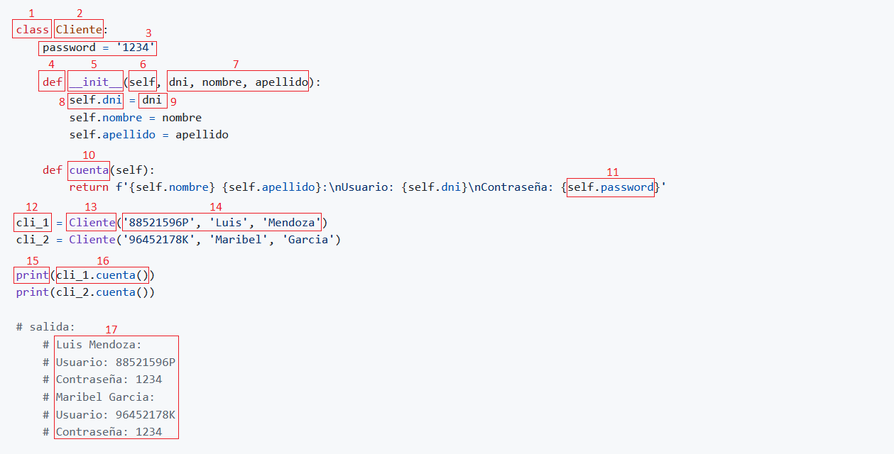

---
hide:
  #- navigation
  - toc
---

# <center>Checkpoint 06</center>

## **Documentación Python** :material-language-python:

!!! info "ÍNDICE DE CONTENIDOS"

    ### 1. Introducción al uso de clases
    ### 2. ¿Qué es un método dunder?
    ### 3. ¿Qué es un decorador?
    ### 4. ¿Qué es el polimorfismo?
    ### 5. ¿Qué es una API?
    ### 6. ¿Es MongoDB una base de datos SQL o NoSQL?
<br>

## <p style="color:#308830;">**1. Introducción al uso de clases**</p>

<p>Python es un lenguaje orientado a objetos, no es necesario hacer uso de ellas para poder crear un programa. De hecho, hemos estado trabajando hasta ahora sin hacer mención a ellas ni emplearlas.</p>

<p>Hasta ahora, hemos construido aplicaciones pequeñas de manera secuenciada y desorganizada. Esto no significa que lo hayamos hecho mal, lo que quiero decir es, que cuando empecemos a crear aplicaciones diámicas y sean mas complejas, necesitaremos mejorar la estructura del código, la organización y crear código reutilizable y facilitar su mantenimiento.</p>
<br>

### 1.1. Clase estática:

!!! warning "PRECAUCIÓN"
    Hay que evitar el mal uso de las clases, en este ejemplo, vemos que las variables no son reutilizables, tampoco podemos pasarle argumentos.
<br>


<br>

<p><strong>Código Python 👇</strong></p>

```python
class Cliente:

    dni = '88521596P'
    nombre = 'Luis'
    apellido = 'Mendoza'

    def __init__(self):
        print(f'DNI: {self.dni}\nNombre: {self.nombre}\nApellido: {self.apellido}')


Cliente()

# salida:
    # DNI: 88521596P
    # Nombre: Luis
    # Apellido: Mendoza
```

- ❌ Estructurado.
- ❌ Organizado.
- ❌ Escalable.
- ❌ Reutilizable.
<br>

### 1.2. Clase dinámica:

<p>La manera recomendada de contruir aplicaciónes con <strong>código reutilizable</strong> y <strong>organizada</strong>, es con el uso de las <strong>clases</strong>. Al principio, es normal que te sientas perdido con todo esto de las clases, pero no te preocupes, todos hemos pasado por esta etapa.</p>

<p>Para crear una clase, vamos a emplear la palabra reservada <code>class</code> seguido de un nombre escrito en PascalCase, primera letra de cada palabra se escribe en mayúscula, y sin guiones bajos. Sabemos que las <strong>clases</strong> pueden contener <strong>funciones</strong>, a las que llamamos <strong>métodos</strong>. Una <strong>clase</strong> también puede contener <strong>variables</strong>, a las que se conoce con el nombre de <strong>atributos</strong>. Para crear <strong>atributos</strong>, primero definimos un <strong>método especial</strong> llamado <code>__init__()</code>, que es invocado por Python automáticamente siempre que se crea una instancia de la clase (conocido también como <strong>constructor</strong> o <strong>inicializador</strong>).</p>

<p>Los <strong>clientes</strong> que vayamos a crear, no tendrán el mismo <code>dni</code>, <code>nombre</code> ni <code>apellido</code>. Por ello sería conveniente permitir que, al definir una instancia, se pase como <strong>argumento</strong> el <strong>dni del cliente</strong> y éste se almacene en el <strong>atributo</strong> <code>self.dni</code>, <strong>nombre del cliente</strong> en el <strong>atributo</strong> <code>self.nombre</code> y <strong>apellido del cliente</strong> en el <strong>atributo</strong> <code>self.apellido</code>.</p>
<br>

!!! info "IMPORTANTE"
    Dentro de la clase, las variables pasan a llamarse <strong>atributos</strong>, el <strong>primer atributo obligatorio</strong> siempre sera <code>self</code>, las funciones pasan a llamarse <strong>métodos</strong>, nos permite pasarle <strong>argumentos</strong> y eso hace que el código sea <strong>reutilizable</strong>. Estas son las razones por el cual se crearon las clases en programación.
<br>


<br>

<p><strong>Código Python 👇</strong></p>

```python
class Cliente:
    def __init__(self, dni, nombre, apellido):
        self.dni = dni
        self.nombre = nombre
        self.apellido = apellido
        
        print(f'DNI: {self.dni}\nNombre: {self.nombre}\nApellido: {self.apellido}')

Cliente('88521596P', 'Luis', 'Mendoza')
Cliente('96452178K', 'Maribel', '')

# salida:
    # DNI: 88521596P
    # Nombre: Luis
    # Apellido: Mendoza
    # DNI: 96452178K
    # Nombre: Maribel
    # Apellido:
```
<br>

### 1.3. Crear objetos con clase:

!!! tip "TIP"
    Antes del auge de la POO, la programación estaba dominada por el paradigma procedimental. Este enfoque estructuraba los programas como una serie de instrucciones secuenciales y dependía en gran medida de funciones y datos globales. Si bien este modelo era efectivo para problemas simples, se volvió difícil de manejar a medida que los sistemas se hicieron más complejos debido a la falta de separación clara entre los datos y las operaciones.
<br>

**Python es un lenguaje multiparadigma:**
  - Soporta la programación imperativa y funcional.
  - Soporta la programación orientada a objetos (POO).
<br>

<p>En este ejemplo, vamos a crear <strong>2 objetos</strong> que se van a llamar <code>cli_1</code> y <code>cli_2</code>. <code>cli_1</code> va tener DNI, Nombre, Apellido y el <code>cli_2</code> va tener solamente DNI, Nombre. La ventaja de poder crear estos objetos de una forma tan simplificada, es impresionante.</p>
<br>

<p><strong>Código Python 👇</strong></p>

```python
class Cliente:

    def __init__(self, dni, nombre, apellido):
        self.dni = dni
        self.nombre = nombre
        self.apellido = apellido

cli_1 = Cliente('88521596P', 'Luis', 'Mendoza')
cli_2 = Cliente('96452178K', 'Maribel', '')

print(f'DNI: {cli_1.dni}\nNombre: {cli_1.nombre}\nApelllido: {cli_1.apellido}')
print(f'DNI: {cli_2.dni}\nNombre: {cli_2.nombre}')

# salida:
    # DNI: 88521596P
    # Nombre: Luis
    # Apellido: Mendoza
    # DNI: 96452178K
    # Nombre: Maribel
    # Apellido:
```
<br>

### 1.4. Métodos dentro de una clase:

<p>En este ejemplo, vamos a crear un <strong>método normal</strong> llamado <code>cuenta</code>, el <strong>primer atributo</strong> obligatorio se llama <code>self</code>, seguido pondremos nuestros <strong>atributos</strong> opcionales separadas por una <code>,</code>coma y cerramos la linea con <code>:</code> dos puntos.</p>

<p>Dentro del método, <strong>indentamos</strong> con 4 espacios para empezar a escribir nuestro <strong>código de ejecución</strong>. En este caso, vamos a emplear <code>return</code> para retornar un mensaje que ponga <strong>Cuenta: El cliente ????????? tiene cuenta</strong>. Con esto, ya tendriamos nuestra clase completado.</p>

<p>Utilizaremos los mismos <strong>objetos</strong> <code>cli_1</code> y <code>cli_2</code> creados en el ejercicio anterior. La forma de acceder a ello es, llamamos primero al objeto <code>cli_1</code> y ponemos un <code>.</code> punto y llamamos al metodo <code>cuenta</code>. Al tratarse de un método, como toda función, devemos cerrarla con <code>()</code>parentesis. El código quedaria de la siguiente manera <code>cli_1.cuenta()</code></p>

<p>Finalizamos el ejemplo con la función <code>print()</code> para <strong>imprimir en pantalla</strong> lo que hemos programado en esta <strong>clase</strong>, <code>print(cli_1.cuenta())</code> y <code>print(cli_2.cuenta())</code></p>
<br>

<p><strong>Código Python 👇</strong></p>

```python
class Cliente:

    def __init__(self, dni, nombre, apellido):
        self.dni = dni
        self.nombre = nombre
        self.apellido = apellido

    def cuenta(self):
        return f'Cuenta: El cliente {self.dni} tiene cuenta'

cli_1 = Cliente('88521596P', 'Luis', 'Mendoza')
cli_2 = Cliente('96452178K', 'Maribel', '')

print(cli_1.cuenta())
print(cli_2.cuenta())

# salida:
    # Cuenta: El cliente 88521596P tiene cuenta
    # Cuenta: El cliente 96452178K tiene cuenta
```
<br>

### 1.5. Estructura básica de una clase:

<p>Llegados aqui, aprenderemos los conceptos básicos que construyen una clase. Trata de leer el código y entender lo que sucede en cada paso.</p>



!!! note "**Descripción de conceptos:**"

    1. `class` Declara una <strong>clase</strong>.
    2. `Cliente` Asigna un <strong>nombre</strong> a la clase, siempre en PascalCase y sin guiones bajos.
    3. `password = '1234'` Declara una <strong>variable de clase</strong>.
    4. `def` Declara un <strong>método</strong>.
    5. `__init__` Lleva dos guiones al principio y al final del nombre, se le conoce como <strong>método dunder, especial o mágico</strong>.
    6. `self` Es el <strong>primer atributo obligatorio</strong> siempre.
    7. `dni`,<code>nombre</code>, <code>apellido</code> Se llaman <strong>atributos</strong> del método y van separados por una <code>,</code> coma.
    8. `self.dni` Declara una <strong>variable de instancia</strong>.
    9. `dni` Guarda el <strong>valor</strong> de la variable de instancia.
    10. `cuenta` Asigna un <strong>nombre</strong> al método.
    11. `self.password` <strong>Hace referencia</strong> a la variable de instancia para retornar su valor.
    12. `cli_1` Crea un <strong>objeto</strong>.
    13. `Cliente` <strong>Invoca</strong> a la clase desde cualquier parte de la aplicación.
    14. `'88521596P'`, <code>'Luis'</code>, <code>'Mendoza'</code> Se llaman <strong>argumentos</strong>.
    15. `Print` Es una función para <strong>imprimir</strong> en pantalla.
    16. `cli_1.cuenta` hace referencia al <strong>objeto</strong> <code>cli_1</code> para acceder a la clase y ejecutar el <strong>método</strong> <code>cuenta</code>.
    17. Visualizamos los datos en la pantalla.
<br>

<p><strong>Código Python 👇</strong></p>

```python
class Cliente:
    password = '1234'

    def __init__(self, dni, nombre, apellido):
        self.dni = dni
        self.nombre = nombre
        self.apellido = apellido

    def cuenta(self):
        return f'{self.nombre} {self.apellido}:\nUsuario: {self.dni}\nContraseña: {self.password}'

cli_1 = Cliente('88521596P', 'Luis', 'Mendoza')
cli_2 = Cliente('96452178K', 'Maribel', 'Garcia')

print(cli_1.cuenta())
print(cli_2.cuenta())

# salida:
    # Luis Mendoza:
    # Usuario: 88521596P
    # Contraseña: 1234
    # Maribel Garcia:
    # Usuario: 96452178K
    # Contraseña: 1234
```

- ✅ Facil de estructurar.
- ✅ Facil de organizar.
- ✅ Facil de leer.
- ✅ Facil de escalar.
- ✅ Código reutilizable.

!!! info "IMPORTANTE"
    Las variables de clase son útiles cuando queremos utilizar un mismo valor en cualquiera de los metodos. Son accesibles desde cualquier método. Dentro de las clases, no se recomienda el uso de las condicionales. Su uso está enfocado en gestionar datos y métodos.

💬 Es fundamental entender bien la estructura y la lógica de las clases para poder seguir avanzando y evitar estancamientos en el futuro.
<hr>
<br>

## <p style="color:#308830;">**2. ¿Qué es un método dunder?**</p>

<p>En programación orientada a objetos, los métodos dunder o métodos mágicos son funciones especiales que permiten definir comportamientos específicos para las clases. Estos métodos se llaman “mágicos” porque su nombre comienza y termina con dos guiones bajos (__).</p>

!!! tip "TIP"
    Los métodos mágicos son una herramienta poderosa que permite definir comportamientos específicos para las clases en Python. Utilizarlos de forma adecuada puede hacer que nuestro código sea más fácil de entender y mantener.
<br>

### 2.1. Tipos de métodos dunder:

- `__init__`: Se utiliza para inicializar objetos y es invocado automáticamente cuando se crea una instancia de la clase.
- `__str__`: Se utiliza para representar el objeto en forma de cadena de texto.
- `__len__`: Permite determinar la longitud de un objeto.

<p>Existen muchos otros métodos mágicos que pueden ser útiles, como <code>__add__</code> (para sumar objetos), <code>__eq__</code> (para comparar igualdad), <code>__lt__</code> (para comparar menor que), entre otros. Sin embargo, es importante tener en cuenta que no siempre es necesario utilizar estos métodos y que su uso variará dependiendo de cada caso específico.</p>
<br>

- Ejemplo `__init__`:
```python
class Persona:
    def __init__(self, nombre):
        self.nombre = nombre

p = Persona('Juan')
print(p.nombre)
```

- Ejemplo `__init__` con `__str_`:
```python
class Persona:
    def __init__(self, nombre):
        self.nombre = nombre

    def __str__(self):
        return f'Mi nombre es {self.nombre}'

p = Persona('Juan')
print(p)
```

- Ejemplo `__init__` con `__len__`:
```python
class Lista:
    def __init__(self, elementos):
        self.elementos = elementos

    def __len__(self):
        return len(self.elementos)

l = Lista([1,2,3,4,5])
print(len(l)) # Imprime 5
```

!!! info "IMPORTANTE"
    El primer ejemplo y el segundo ejemplo tienen el mismo resultado, lo que hace el método dunder `__str__` es convertir el objeto en una cadena de texto.
<br>

###  2.2. ¿Qué método dunder se ejecuta automáticamente?

<p>El método <code>__init__</code>, es un método especial que se <strong>ejecuta automáticamente</strong> al invocar la clase e inicializara los atributos del objeto que le ayamos creado. Es decir, es imposible de olvidarse llamarlo ya que se llamará automáticamente.</p>

!!! info "IMPORTANTE"
    El método `__init__` es el primer método que se ejecuta dentro de una clase.
<br>

### 📝 Características:

- El método `__init__` no puede retornar <code>return</code> datos, no devuelve nada.
- El método `__init__` puede recibir parámetros que se utilizan para inicializar atributos de forma automática.
- El método `__init__` es un constructor de instancias.
- El método `__init__` es un método opcional, de todos modos es muy común declararlo.
<hr>
<br>

## <p style="color:#308830;">**3. ¿Qué es un decorador?**</p>

<p>Los decoradores son funciones que toman otra función como argumento y anidan una nueva función para agregarle código extra sin alterar la existente.</p>

<p>En el siguiente ejemplo, puedes ver la <strong>estructura general de una función decoradora</strong>.</p>

!!! tip "TIP"
    Si alguna vez has visto <code>@</code>, estás ante un <strong>decorador</strong>.
<br>


<br>

<p><strong>Código Python 👇</strong></p>

```python
def decorador(f):

    def funcion_nueva():
        print('Funcionalidad extra')
        f()
    return funcion_nueva

@decorador
def funcion_inicial():
    print('Funcionalidad inicial')

funcion_inicial()
```
<br>

### 🕵️ Analicemos estos elementos en más detalle:

- Esta es la <code>función_inicial</code> que el <code>@decorador</code> va tomar como referencia.
```python
@decorador
def funcion_inicial():
    print('Funcionalidad inicial')

funcion_inicial()
```

- Esta es una función intermediaria que va hacer la <strong>decoradoración</strong> <code>def decorador</code>. El nombre de la función hace referencia a <code>@decorador</code>. Toma <code>(f)</code> como argumento para invocar <code>f()</code> más adelante dentro de la <code>función_nueva()</code> que va ir anidada.

```python
def decorador(f):
    def funcion_nueva():
        print('Funcionalidad extra')
        f()
    return funcion_nueva
```

- Si ejecutamos el código, podemos ver el siguiente resultado:

```
Funcionalidad extra
Funcionalidad inicial
```
<hr>
<br>

## <p style="color:#308830;">**4. ¿Qué es el polimorfismo?**</p>

<p>El polimorfismo tiene como objetivo cambiar la funcionalidad entre los métodos con el mismo nombre, en este ejemplo, tenemos tres clases, a los métodos les hemos asignado el mismo nombre <code>desplazamiento</code>. A pesar de que lleven el mismo nombre, los podemos diferenciar creando una nueva función y pasandole como atributo, por ejemplo <code>vehiculo</code>. El <code>vehiculo</code> tomara el valor de <code>mi_vehiculo</code> para hacer la mágia del polimorfismo. A la variable <code>mi_vehiculo</code>, podemos pasarle cualquiera de las tres clases, <code>Moto()</code>, <code>Coche()</code>, <code>Camion()</code>.</p>
<br>


<br>

<p><strong>Código Python 👇</strong></p>

```python
class Moto():

    def desplazamiento(self):
        print('Me desplazo utilizando 2 ruedas')

class Coche():

    def desplazamiento(self):
        print('Me desplazo utilizando 4 ruedas')

class Camion():

    def desplazamiento(self):
        print('Me desplazo utilizando 6 ruedas')

def desplazamiento_vehiculo(vehiculo):
    vehiculo.desplazamiento()

mi_vehiculo = Coche()
desplazamiento_vehiculo(mi_vehiculo)

# salida:
    # Me desplazo utilizando 4 ruedas
```
<br>

!!! info "IMPORTANTE"
    El polimorfismo puede acceder a cualquiera de las clases y ejecutar métodos independientemente del nombre que tengan.
<hr>
<br>

## <p style="color:#308830;">**5. ¿Que es una API?**</p>

<p>Una <strong>API</strong> es una (interfaz de programación de aplicaciones) que sigue un conjunto de restricciones arquitecturales basadas en HTTP. Esto significa que se puede acceder a los recursos a través de URLs, lo que hace que la API sea fácil de entender y utilizar. Podemos crear una API que haga literalmente cualquier cosa, desde dar clima hasta un catálogo completo de una tienda en línea. Casi todas las aplicaciones utilizan APIs para conectarse con fuentes de datos corporativas, servicios de datos de terceros u otras aplicaciones.</p>


!!! tip "TIP"
    El formato de intercambio de datos normalmente es JSON o XML, lo que permite que la API sea compatible con una amplia variedad de aplicaciones.
<br>


<br>
<br>

### 5.1. Una API tiene dos componentes principales:

  - **Recursos:**

    - Datos o información.

  - **Verbos HTTP:**

    - `GET` para consultar y leer.
    - `POST` para crear.
    - `PUT` para editar.
    - `DELETE` para eliminar.

!!! info "IMPORTANTE"
    Los <strong>recursos</strong> son los datos o información que se pueden acceder a través de la API. Los <strong>verbos HTTP</strong> son las operaciones que se pueden realizar en esos recursos, como obtener <code>GET</code> un recurso, crear <code>POST</code> un recurso, actualizar <code>PUT</code> un recurso o eliminar <code>DELETE</code> un recurso.
<br>

### 5.2. ¿De donde obtiene la API toda la información?

<p>La información de la api no sale de la nada, necesita ser construido por alguien en formato diccionario. Se puede construir de manera manual o cargarle la información desde una base de datos. Cuando abrimos la url donde esta alojado el API, veremos un monton de datos en formato diccionario <code>{...}</code>. Puede contener anidamientos tanto de diccionarios como de listas en su interior.</p>

Formato de una API 👇
```json
{
  "id": 1,
  "nombre": "Juan",
  "apellido": "Garcia",
  "pais": "España"
},
{
  "id": 2,
  "nombre": "Nerea",
  "apellido": "Larralde",
  "pais": "España"
}
```

!!! tip "TIP"
    Puedes practicar con esta <strong>API de Rick and Morty</strong> https://rickandmortyapi.com/api/character/ utilizando la aplicación <strong>Postman</strong> https://www.postman.com/ para testear con APIs.

    Si accede a `https://rickandmortyapi.com/api/character/131` por numero de id al personaje, nos devolvera un json con toda la información.
<br>

### 5.3. ¿Qué es Postman?

<p>Se trata de una herramienta dirigida a desarrolladores web que permite realizar peticiones HTTP a cualquier API. Postman es muy útil a la hora de programar y hacer pruebas, puesto que nos ofrece la posibilidad de comprobar el correcto funcionamiento de nuestros desarrollos.</p>

<p>Con esto no queremos decir que Postman sea una herramienta exclusiva para profesionales del entorno web, de hecho va a ser muy útil para todo aquel que tenga que interactuar con una API.</p>

### Características principales:

  - **Envío de solicitudes:**

    - Postman permite enviar solicitudes HTTP y HTTPS utilizando métodos como GET, POST, PUT y DELETE, entre otros. Los desarrolladores pueden especificar parámetros, encabezados y el cuerpo de la solicitud para simular diversas interacciones con una API.

  - **Pruebas automatizadas:**

    - Con Postman, los desarrolladores pueden crear y ejecutar pruebas automatizadas para verificar el comportamiento de una API. Esto ayuda a detectar errores de manera temprana y a garantizar que el software cumpla con los estándares de calidad.
<br>

!!! tip "TIP"
    API de testeo https://rickandmortyapi.com
<hr>
<br>

## <p style="color:#308830;">**6. ¿Es MongoDB una base de datos SQL o NoSQL?**</p>

<p><strong>MongoDB</strong> es una <strong>base de datos NoSQL</strong> orientada a documentos que apareció el año 2007. Se utiliza para almacenar volúmenes masivos de datos.</p>

### 6.1. ¿Como se almacenan los datos?

<p>A diferencia de una base de datos relacional SQL tradicional, MongoDB no se basa en tablas y columnas. Los datos se almacenan como <strong>colecciones</strong> y <strong>documentos</strong>.</p>

<p>La arquitectura de MongoDB se basa en varios componentes principales. En primer lugar, la clave <strong>_id</strong> es un campo obligatorio para cada documento que se genera de forma automática. Representa un valor único y puede considerarse como la clave principal del documento para identificar al objeto dentro de la colección.</p>
<br>

!!! info "IMPORTANTE"
    - <strong>Colecciones</strong>: Se refiere a un diccionario <code>{...}</code> o lista <code>[...]</code>.
    - <strong>Documentos</strong>: Se refiere a la <code>"clave": "valor"</code> dentro de un diccionario. 
<br>


```js
{
    "_id": ObjectId("5cf0029caff5056591b0ce7d"),
    "nombre": "Juan",
    "apellido": "Garcia",
},
{
    "_id": ObjectId("6sh5930rdee4058890b0ae5c"),
    "nombre": "Nerea",
    "apellido": "Larralde",
    "telefono": "666-666-444",
    "direccion":  {
        "codigo_postal": "22222",
        "provincia": "Gipuzkoa",
        "pais": "España"
    }
}
```

!!! info "IMPORTANTE"
    MongoDB almacena los datos en documentos flexibles al estilo JSON pero los reconoce como <string>BSON</string>, esto vendria a ser un JSON binario.
<br>

### 👨‍💻 6.1. Comandos para interactuar con la base de datos desde la terminal:

<p>MQL es el lenguaje de consulta y manipulación de información que MongoDB nos provee por defecto (MongoDB Query Language). Las consultas de MongoDB se basan en el lenguaje de programación JavaScript con algunas diferencias leves.</p>
<br>

  - **Consultar** todos los documentos que tenemos en la base de datos sin formatear la estructura:
    - Código: `db.nombre_de_tu_base_de_datos.find()`.
  - **Consultar** todos los documentos que tenemos en la base de datos con la estructura formateada:
    - Código: `db.nombre_de_tu_base_de_datos.find().pretty()`.
  - **Consultar** todos los documentos que coincidan con el valor del apellido:
    - Código: `db.nombre_de_tu_base_de_datos.find({apellido: "Larralde"}).pretty()`.
  - **Consultar** cuantos documentos coinciden con el valor del apellido:
    - Código: `db.nombre_de_tu_base_de_datos.find({apellido: "Larralde"}).length()`.
  - **Consultar** cuantos documentos coinciden con el valor del apellido utilizando Regex:
    - Código: `db.nombre_de_tu_base_de_datos.find({apellido: /.*Larralde.*/i})`.
  - **Consultar** en el documento si existe una clave o no:
    - Código: `db.nombre_de_tu_base_de_datos.find({apellido: $exists: true})`.
  - **Eliminar** todos los documentos que coincidan con el valor del apellido:
    - Código: `db.nombre_de_tu_base_de_datos.remove({apellido: "Larralde"})`.
  - **Eliminar** un documento que coincida con el valor del apellido:
    - Código: `db.nombre_de_tu_base_de_datos.remove({apellido: "Larralde"}, 1)`.
<br>

  - **Insertar** un nuevo documento 👇
```js
db.nombre_de_tu_base_de_datos.insert({
    "nombre": "Carlos",
    "apellido": "Garrido",
    "direccion": {
        "codigo_postal": "45210",
        "provincia": "Gipuzkoa",
        "pais": "España"
    }
});
```
<br>

!!! tip "TIP"
    Descargar MongoDB desde [https://www.mongodb.com/try/download/community](https://www.mongodb.com/try/download/community).

    Para más información, consulte en su [página oficial](https://www.mongodb.com/es).
  <br>
  <br>
