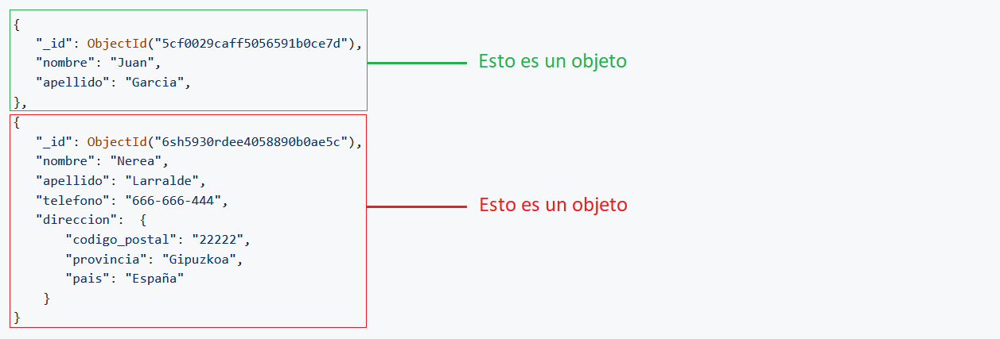

---
hide:
  #- navigation
  #- toc
---

# 6. ¿Es MongoDB una base de datos SQL o NoSQL?

<p><strong>MongoDB</strong> es una <strong>base de datos NoSQL</strong> orientada a documentos que apareció el año 2007. Se utiliza para almacenar volúmenes masivos de datos.</p>

### 6.1. ¿Como se almacenan los datos?

<p>A diferencia de una base de datos relacional SQL tradicional, MongoDB no se basa en tablas y columnas. Los datos se almacenan como <strong>colecciones</strong> y <strong>documentos</strong>.</p>

<p>La arquitectura de MongoDB se basa en varios componentes principales. En primer lugar, la clave <strong>_id</strong> es un campo obligatorio para cada documento que se genera de forma automática. Representa un valor único y puede considerarse como la clave principal del documento para identificar al objeto dentro de la colección.</p>
<br>

!!! info "IMPORTANTE"
    - <strong>Colecciones</strong>: Se refiere a un diccionario <code>{...}</code> o lista <code>[...]</code>.
    - <strong>Documentos</strong>: Se refiere a la <code>"clave": "valor"</code> dentro de un diccionario. 
<br>



```js
{
    "_id": ObjectId("5cf0029caff5056591b0ce7d"),
    "nombre": "Juan",
    "apellido": "Garcia",
},
{
    "_id": ObjectId("6sh5930rdee4058890b0ae5c"),
    "nombre": "Nerea",
    "apellido": "Larralde",
    "telefono": "666-666-444",
    "direccion":  {
        "codigo_postal": "22222",
        "provincia": "Gipuzkoa",
        "pais": "España"
    }
}
```

!!! info "IMPORTANTE"
    MongoDB almacena los datos en documentos flexibles al estilo JSON pero los reconoce como <string>BSON</string>, esto vendria a ser un JSON binario.
<br>

### 👨‍💻 6.1. Comandos para interactuar con la base de datos desde la terminal:

<p>MQL es el lenguaje de consulta y manipulación de información que MongoDB nos provee por defecto (MongoDB Query Language). Las consultas de MongoDB se basan en el lenguaje de programación JavaScript con algunas diferencias leves.</p>
<br>

  - **Consultar** todos los documentos que tenemos en la base de datos sin formatear la estructura:
    - Código: `db.nombre_de_tu_base_de_datos.find()`.
  - **Consultar** todos los documentos que tenemos en la base de datos con la estructura formateada:
    - Código: `db.nombre_de_tu_base_de_datos.find().pretty()`.
  - **Consultar** todos los documentos que coincidan con el valor del apellido:
    - Código: `db.nombre_de_tu_base_de_datos.find({apellido: "Larralde"}).pretty()`.
  - **Consultar** cuantos documentos coinciden con el valor del apellido:
    - Código: `db.nombre_de_tu_base_de_datos.find({apellido: "Larralde"}).length()`.
  - **Consultar** cuantos documentos coinciden con el valor del apellido utilizando Regex:
    - Código: `db.nombre_de_tu_base_de_datos.find({apellido: /.*Larralde.*/i})`.
  - **Consultar** en el documento si existe una clave o no:
    - Código: `db.nombre_de_tu_base_de_datos.find({apellido: $exists: true})`.
  - **Eliminar** todos los documentos que coincidan con el valor del apellido:
    - Código: `db.nombre_de_tu_base_de_datos.remove({apellido: "Larralde"})`.
  - **Eliminar** un documento que coincida con el valor del apellido:
    - Código: `db.nombre_de_tu_base_de_datos.remove({apellido: "Larralde"}, 1)`.
<br>

  - **Insertar** un nuevo documento 👇
```js
db.nombre_de_tu_base_de_datos.insert({
    "nombre": "Carlos",
    "apellido": "Garrido",
    "direccion": {
        "codigo_postal": "45210",
        "provincia": "Gipuzkoa",
        "pais": "España"
    }
});
```
<br>

!!! tip "TIP"
    Descargar MongoDB desde [https://www.mongodb.com/try/download/community](https://www.mongodb.com/try/download/community).

    Para más información, consulte en su [página oficial](https://www.mongodb.com/es).
  <br>
  <br>
