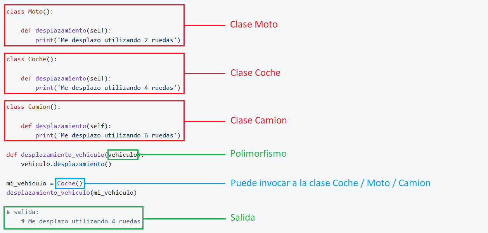

---
hide:
  #- navigation
  - toc
---

# <span style="color:#308830;">**4. ¿Qué es el polimorfismo?**</span>

<p>El polimorfismo tiene como objetivo cambiar la funcionalidad entre los métodos con el mismo nombre, en este ejemplo, tenemos tres clases, a los métodos les hemos asignado el mismo nombre <code>desplazamiento</code>. A pesar de que lleven el mismo nombre, los podemos diferenciar creando una nueva función y pasandole como atributo, por ejemplo <code>vehiculo</code>. El <code>vehiculo</code> tomara el valor de <code>mi_vehiculo</code> para hacer la mágia del polimorfismo. A la variable <code>mi_vehiculo</code>, podemos pasarle cualquiera de las tres clases, <code>Moto()</code>, <code>Coche()</code>, <code>Camion()</code>.</p>
<br>


<br>

<p><strong>Código Python 👇</strong></p>

```python
class Moto():

    def desplazamiento(self):
        print('Me desplazo utilizando 2 ruedas')

class Coche():

    def desplazamiento(self):
        print('Me desplazo utilizando 4 ruedas')

class Camion():

    def desplazamiento(self):
        print('Me desplazo utilizando 6 ruedas')

def desplazamiento_vehiculo(vehiculo):
    vehiculo.desplazamiento()

mi_vehiculo = Coche()
desplazamiento_vehiculo(mi_vehiculo)

# salida:
    # Me desplazo utilizando 4 ruedas
```
<br>

!!! info "IMPORTANTE"
    El polimorfismo puede acceder a cualquiera de las clases y ejecutar métodos independientemente del nombre que tengan.
<br>
<br>
