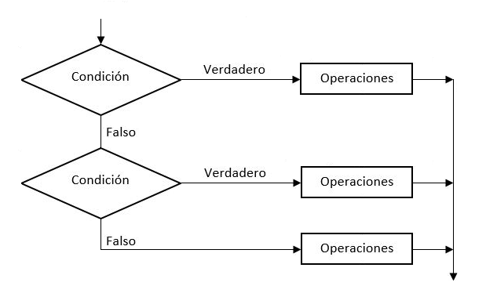
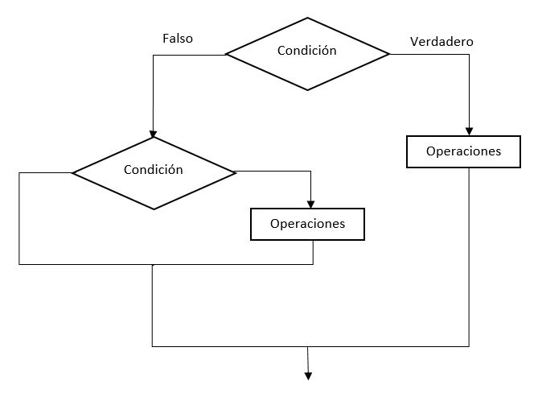

---
hide:
  #- navigation
  - toc
---

# 4. ¿Qué es un condicional?
Hasta ahora, hemos visto cómo resolver los problemas más sencillos pero no podemos resolver todo utilizando estructuras secuenciales. Cuando tenemos que tomar una decisión aparecen las estructuras condicionales. Por ejemplo, en nuestra vida diaria hay momentos donde tenemos que decidir entre un pantalón u otro, un camino u otro. En estos casos es común resolver un problema combinando estructuras secuenciales y condicionales.

JavaScript cuenta con **4 tipos de condicionales**:

  - Condicional ==if==
  - Condicional ==else==
  - Condicional ==else if==
  - Condicional ==switch==
<br>

### 4.1. Condicional simple con ==if==
Podemos ver un ejemplo de una **estructura condicional simple** con el siguiente esquema.

!!! info "IMPORTANTE"
    Puedes usar ==if== solo una vez por bloque y no es obligatorio complementarlo con ==else==.


<br>

Podemos observar en el esquema que **el rombo representa la condición** y tenemos dos opciones que podemos tomar. Si la condición devuelve un resultado verdadero, ejecutará las opciones que se encuentren en su interior, si por el contrario es falso, no realizará dicha acción.

Vamos a ver el **primer ejemplo y el mas simple** con el ==**if**==, le pasamos por variable `edad = 20`, si tiene 18 o mas años, muestra un mensaje `Soy mayor de edad porque tengo 18 o mas años.` y si tiene menos de 18 años, no nos muestra ningun mensaje.

```js title="ejemplo.js"
let edad = 20;
if (edad >= 18) {
    console.log(`Soy mayor de edad porque tengo ${edad} o mas años.`)
}
```

La palabra clave `if` implica el inicio de una condición, seguidamente incluimos la condición entre `()` **paréntesis** y finalizamos la línea con el carácter `{` **apertura de llave**.

Una de las características de JavaScript que además ayuda a tener una estructura organizada es la indentación o sangrado de texto con dos o cuatro espacios. Es decir, si queremos incluir una condición, el texto que deba ir en su interior debe ir con cuatro espacios con respecto al inicio de la palabra `if`.

### 4.2. Condicional alternativa con ==if== ==else==
Podemos ver un ejemplo de una **estructura condicional compuesta** con el siguiente esquema.

!!! info "IMPORTANTE"
    Puedes usar ==else== solo una vez por condición ==if==.


<br>

Cuando se presenta una elección entre ==**if**== o ==**else**==, tenemos la opción de realizar una acción u otra, es decir, tenemos operaciones diferentes a ejecutar si la condición es **verdadera** o es **falsa**. Es decir, ==se tomara una de las 2 elecciones de la bifurcación==.

Vamos a volver a realizar el ejercicio anterior pero, con la diferencia, de que si la edad es menor a 18 años, nos muestre un mensaje `Soy menor de edad porque tengo menos de 18 años.`.

```js title="ejemplo.js"
edad = 16;
if (edad >= 18) {
    console.log(`Soy mayor de edad porque tengo ${edad} o mas años.`)
}
else {
    console.log(`Soy menor de edad porque tengo menos de ${edad} años.`);
}
```

Como podemos ver, si la condición es falsa, y queremos que realice una operación, la forma sería incluyendo la palabra `else` en una línea nueva seguida del carácter `{` apertura de llave. Después las operaciones necesarias que queramos ejecutar separadas con 4 espacios con respecto a la línea de la palabra `else`. Despues de la operación y en una nueva línea, toca cerrar `}` la llave y con eso, finaliza el bloque `else`.

### 4.3. Condicional encadenada con ==if== ==else if== ==else==
Podemos ver un ejemplo de una **estructura condicional encadenada** con el siguiente esquema.

!!! info "IMPORTANTE"
    El flujo de ejecucción se prioriza siempre de arriba hacia abajo y puedes crear tantas ==else if== que desees.


<br>

Cuando se presentan mas de dos elecciónes a elegir entre `if` `else if` y `else`, ==se tomara como válida, solamente una de las 3 elecciones de la bifurcación==. El flujo de ejecución se priorizara siempre de arriba hacia abajo.

Vamos a volver a realizar el ejercicio anterior con una condiciónal mas, que sera la condicional `else if`, pero con la diferencia, de que si la edad es mayor o igual a 67 años, nos muestre un mensaje `Tengo 70 años y estoy jubilado.`. El resto de las condicionales se mantienen igual.

```js title="ejemplo.js"
let edad = 36;

if (edad >= 67) {
    console.log(`Tengo ${edad} años y estoy jubilado.`);
}
else if (edad >= 18) {
    console.log(`Soy mayor de edad porque tengo ${edad} o mas años.`)
}
else {
    console.log(`Soy menor de edad porque tengo menos de ${edad} años.`);
}
```

Como vemos en el ejempo anterior, ==el uso de la condicional **else if**, nos da la posibilidad de crear muchas condiciones sobre un mismo **if**== ya que su uso no esta limitado. Recuerda que cuanto mas corto y menos condicionales tenga el bloque, mas legible sera el código.

### 4.4. Condicionales anidadas
Podemos ver un ejemplo de una ==estructura condicional anidado== con el siguiente esquema.

!!! info "IMPORTANTE"
    Podemos tener infinidad de condiciones anidadas pero en la medida de lo posible, procuraremos anidar lo menos posible.


<br>

### 4.5. Condicional ==switch==
La estructura de control ==**switch**== permite definir casos específicos a realizar cuando la variable expuesta como condición sea igual a los valores que se especifican a continuación mediante cada ==**case:**==.

==Las sentencias switch no serán apropiadas para usar en todas las situaciones==. Pero si sientes que las sentencias ==**else if**== son largas y complicadas, entonces una sentencia ==**switch**== podría ser una **opción alternativa**. Aunque, mucha gente opina que en lugar de mejorar la legibilidad, normalmente la empeora.

**Veamos un ejemplo de cómo se utiliza:**

```js title="ejemplo.js"
let numero = 88734;

switch (numero) {
    case 00003:
        console.log('¡Primer premio!');
        break;
    case 00012:
        console.log('¡Segundo premio!');
        break;
    case 88734:
        console.log('¡Tercer premio!');
        break;
    // con default, toma la salida de cualquier otra opción
    default:
        console.log(`El número ${numero} no tiene premio`);
        break;
}
```

!!! quote ""
    ==El valor de la variable== (`numero`) ==es 88734, toma la salida== (`case 88734`) con el mensaje ==¡Tercer premio!==

      - **switch**: Se define el tipo de condición que debe cumplir, en este caso, compara el valor de la variable con la opción.
      - **case 00003**: Es la primera opción, si cumple la condición, toma la salida y sale con el break, si no cumple, continua
      - **case 00012**: Es la segunda opción, si cumple la condición, toma la salida y sale con el break, si no cumple, continua
      - **case 88734**: Es la tercera opcion, si cumple la condición, toma la salida y sale con el break, si no cumple, continua
      - **default**: Si no cumple con ninguna condicion anterior, toma la salida con el mensaje (`El número (?) no tiene premio`) y sale con el break
<br>
<br>
