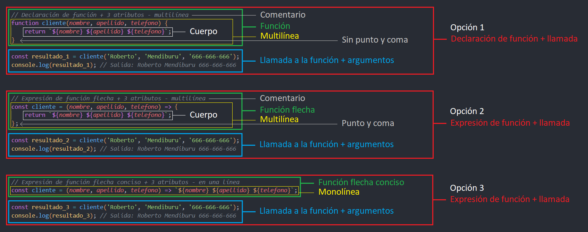

---
hide:
  #- navigation
  - toc
---

# 3. ¿Qué es una función de flecha?
Las **funciones flecha** permiten escribir funciones de manera más concisa y legible, especialmente cuando se trata de **funciones cortas o funciones de una sola línea**.

### :material-arrow-right-circle: Sintaxis de una función flecha:
La sintaxis de una función flecha es la siguiente:

==() => {}==

  - ==**()**== Se utiliza para pasarle atributos a una función
  - ==**=>**== Se define como función flecha, es una función anónima sin nombre
  - ==**{}**== Se utiliza para envolver el cuerpo de la función
<br>
<br>

## **3.1. Tipos de funciónes:**
Antes de nada, veamos una **comparación entre diferentes tipos de funciones**, esto es de vital importancia para entender como funciona cada uno, en que se relacionan y en que situaciones es conveniente utilizar uno u otro.

### Ejemplo 1
En este ejemplo, vamos a comparar **4 tipos de función equivalentes** y ver **en que se diferencian**. Para ello, hemos utilizado una ==declaración de función==, una ==expresión de función==, una ==expresión de función flecha== y una ==expresión de función flecha conciso (en una línea)==. Ninguno incluye atributos.

  - **Opción 1:** ==Declaración de función==
  - **Opción 2:** ==Expresión de función==
  - **Opción 3:** ==Expresión de función flecha==
  - **Opción 4:** ==Expresión de función flecha conciso (en una línea)==

!!! info "IMPORTANTE"
    Si la función consiste en una sola expresión, se puede omitir el bloque de llaves. Solo en (**expresión de función flecha conciso - en una linea**).

    const cliente = () => ==**{ console.log('¡Bienvenido!') }**==; (puedes ver en la **opcion 4** de este ejemplo).

```js title="ejemplo.js"
// Opción 1: Declaración de función
function cliente() {
    console.log('¡Bienvenido!');
}
cliente(); // Salida: ¡Bienvenido!

// Opción 2: Expresión de función
const cliente = function() {
    console.log('¡Bienvenido!');
};
cliente(); // Salida: ¡Bienvenido!

// Opción 3: Expresión de función flecha
const cliente = () => {
    console.log('¡Bienvenido!');
}
cliente(); // Salida: ¡Bienvenido!

// Opción 4: Expresión de función flecha conciso - en una linea
const cliente = () => console.log('¡Bienvenido!');
cliente(); // Salida: ¡Bienvenido!
```
<br>

### Ejemplo 2
Veamos el segundo ejemplo, esta vez, **le pasamos 1 atributo** para ir viendo como se construyen **funciónes flecha**:

  - **Opción 1:** ==Expresión de función flecha + 1 atributo==
  - **Opción 2:** ==Expresión de función flecha conciso + 1 atributo (en una línea)==

!!! info "IMPORTANTE"
    Para funciones con un solo atributo, los paréntesis pueden omitirse.

    const cliente = **==(nombre)==** => console.log(`${nombre}`);

```js title="ejemplo.js"
// Opcion 1: Expresión de función flecha + 1 atributo
const cliente = nombre => {
    console.log(`${nombre}`);
}
cliente('Roberto'); // Salida: Roberto

// Opcion 2: Expresión de función flecha conciso + 1 atributo - en una linea
const cliente = nombre => console.log(`${nombre}`);
cliente('Roberto'); // Salida: Roberto
```
<br>

### Ejemplo 3
Veamos el tercer ejemplo, a diferencia del segundo ejemplo, **aqui le pasamos 2 atributos**. Vemos una ==expresión de función flecha + 2 atributos== y una ==expresión de función flecha conciso + 2 atributos (en una línea)==.

```js title="ejemplo.js"
// Opcion 1: Expresión de función flecha + 2 atributos
const cliente = (nombre, apellido) => {
    console.log(`${nombre} ${apellido}`);
}
cliente('Roberto', 'Mendiburu'); // Salida: Roberto Mendiburu

// Opción 2: Expresión de función flecha conciso + 2 atributos - en una linea
const cliente = (nombre, apellido) => console.log(`${nombre} ${apellido}`);
cliente('Roberto', 'Mendiburu'); // Salida: Roberto Mendiburu
```
!!! info "IMPORTANTE"
    Si el cuerpo de la función incluye **varias operaciones**, se recomienda el uso de **expresión de función flecha**, (puedes ver en la **opcion 2** de este ejemplo).
<br>

## **3.2. Tipos de funciónes flecha:**
Las **funciones flecha** (arrow functions) son indudablemente una de las características más populares de **ES6** (EcmaScript 6). Ellas introducen una nueva forma de escribir **funciones concisas**. Es importante notar que **las funciones flecha son anónimas**, lo que significa que **no tienen nombre** y no se pueden utilizar como metodos ni constructores dentro de una clase.

### :material-arrow-right-circle: Características:
  - **Siempre son expresiones**, a diferencia de `function` (que puede ser **expresión** o **declaración**).
  - Esto implica que siempre deberemos asignar la expresión a una variable (o una constante).
  - Existen **2 tipos de funciones flecha**:
    - ==Expresión de función flecha (multilínea)==
    - ==Expresión de función flecha conciso (monolínea)==
<br>

### :material-arrow-right-circle: Expresión de función flecha (multilínea):
En este ejemplo, podemos observar cómo ==la **expresión de función flecha** elimina la necesidad de escribir la palabra clave **function**==. Le pasa **2 atributos ==(a, b)==** entre parentesis, le pone la ==**=>**== (flecha) y acaba la fila con la apertura de una ==**{**== (llave) que se cierra despues del cuerpo de la función, en una nueva línea con el cierre de una ==**}**== (llave).

Esta función, esta construido en bloque. Al no estar toda la función en una misma línea, se trataria de una ==**expresión de función flecha** (multilínea) y no obtendria las características de un conciso (en una línea)==.

```js title="ejemplo.js"
// Expresión de función flecha + 2 atributos
const sumar = (a, b) => {
    return a + b;
}

const resultado = sumar(2, 6);
console.log(resultado); // Salida: 8
```
<br>

**Ejemplo con 3 atributos** 👇
```js title="ejemplo.js"
// Expresión de función flecha + 3 atributos
const cliente = (nombre, apellido, telefono) => {
    return (`${nombre} ${apellido} ${telefono}`);
};

const resultado = cliente('Roberto', 'Mendiburu', '666-666-666');
console.log(resultado); // Salida: Roberto Mendiburu 666-666-666
```
<br>

### :material-arrow-right-circle: Expresión de función flecha conciso (monolínea):
En este ejemplo, podemos observar cómo ==la **expresión de función flecha conciso** elimina la necesidad de escribir la palabra clave **function**, las **llaves {}** y la declaración **return**==, resultando en una **expresión más compacta**.

```js title="ejemplo.js"
// Expresión de función flecha conciso + 2 atributos - en una linea
const sumar = (a, b) => a + b;

const resultado = sumar(2, 6);
console.log(resultado); // Salida: 8
```
<br>

**Ejemplo con 3 atributos** 👇
```js title="ejemplo.js"
// Expresión de función flecha conciso + 3 atributos - en una linea
const cliente = (nombre, apellido, telefono) => (`${nombre} ${apellido} ${telefono}`);

const resultado = cliente('Roberto', 'Mendiburu', '666-666-666');
console.log(resultado); // Salida: Roberto Mendiburu 666-666-666
```
<br>

### :material-arrow-right-circle: Análisis de función, función flecha y función flecha conciso:
**Veamos un ejemplo con las 3 opciones** 👇

```js title="ejemplo.js"
// Opción 1:
// Declaración de función + 3 atributos - multilínea
function cliente(nombre, apellido, telefono) {
    return `${nombre} ${apellido} ${telefono}`;
}

const resultado_1 = cliente('Roberto', 'Mendiburu', '666-666-666');
console.log(resultado_1); // Salida: Roberto Mendiburu 666-666-666


// Opción 2:
// Expresión de función flecha + 3 atributos - multilínea
const cliente = (nombre, apellido, telefono) => {
    return `${nombre} ${apellido} ${telefono}`;
};

const resultado_2 = cliente('Roberto', 'Mendiburu', '666-666-666');
console.log(resultado_2); // Salida: Roberto Mendiburu 666-666-666


// Opción 3:
// Expresión de función flecha conciso + 3 atributos - monolínea
const cliente = (nombre, apellido, telefono) => `${nombre} ${apellido} ${telefono}`;

const resultado_3 = cliente('Roberto', 'Mendiburu', '666-666-666');
console.log(resultado_3); // Salida: Roberto Mendiburu 666-666-666
```

### 🕵️ Analicemos las diferencias:


<br>
<br>
