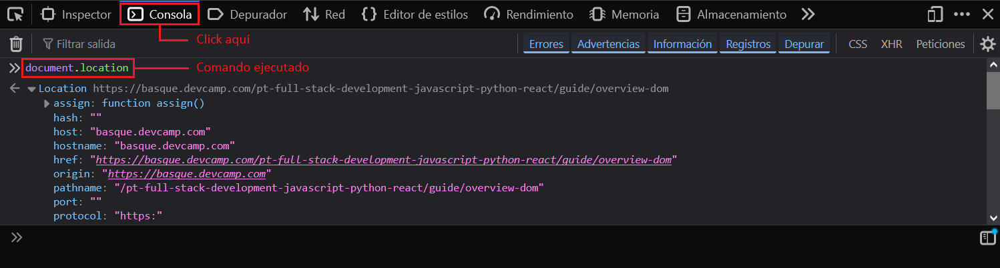
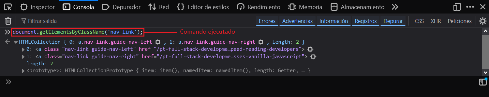

---
hide:
  #- navigation
  #- toc
---

## **¿Que es el DOM?**

Cuando comenzamos en el mundo del desarrollo web, normalmente comenzamos por aprender a escribir etiquetado o marcado HTML y además, añadir estilos CSS para darle color, forma y algo de interacción. Sin embargo, a medida que avanzamos, nos damos cuenta que en cierta forma podemos estar bastante limitados.

Si únicamente utilizamos HTML/CSS, sólo podremos crear páginas (estáticas), es decir, páginas que no pueden realizar tareas dinámicas y personalizadas dependiendo de acciones concretas del usuario o su entorno. Sin embargo, si añadimos Javascript, podremos crear dichas páginas (dinámicas), y aprovechar la potencia y flexibilidad que nos da un lenguaje de programación como Javascript para crear documentos y páginas mucho más ricas, con una experiencia más completa.

Las siglas **DOM** significan Document Object Model, o lo que es lo mismo, la estructura de un documento HTML. Una página HTML está formada por múltiples etiquetas HTML, anidadas una dentro de otra, formando un árbol de etiquetas relacionadas entre sí, que se denomina árbol DOM (o simplemente DOM).

```html linenums="1" title="html"
<html>
  <head>
    <title>Título</title>
  </head>
  <body>
    <div></div>
    <div>
      <p>Párrafo 1</p>
      <p>Párrafo 2</p>
    </div>
  </body>
</html>
```

Observa que como la etiqueta `<head>` está dentro de `<html>` se dibuja como hija de `<html>`. La etiqueta `<title>` está dentro de `<head>`, por lo que será hija de esta y así sucesivamente.

Desde el navegador, la forma de acceder al DOM es a través de un objeto Javascript llamado **document**, que representa el árbol DOM de la página o, más concretamente, la página de la pestaña del navegador donde nos encontramos.

***

## **Como acceder a los objetos desde JS**

Creamos un objeto llamado **usuario**:

```js linenums="1" title="javascript"
const usuario = {
    nombre: 'Aitor',
    apellido: 'Irazoki',
    edad: 32,
    aficiones: [
        Futbol,
        Ciclismo
    ]
}
```

Con el siguiente comando, Accedemos a las propiedades del objeto usuario:

```js linenums="1" title="javascript"
user // accede a todas las propiedades del objeto
user.nombre // accede a la propiedad nombre
```

Para mostrar el resultado de JavaScript en tiempo real, existe una extensión llamada (Quokka.js).

```js linenums="1" title="javascript"
user.nombre //? Aitor
```

El siguiente comando, accede al array del objeto usuario:

```js linenums="1" title="javascript"
user.aficiones //? [ Futbol, Ciclismo ]
user.aficiones[1] //? Ciclismo 
```

## **Como acceder a los objetos desde la consola del navegador**

Una vez entendido como funcionan los objetos en JS, abrimos cualquier página web en el navegador y en cualquier parte de la página, hacemos:

  - ==Click derecho del ratón== -> ==Inspeccionar== para abrir la herramienta de desarrollo.

Con la herramienta de desarrollo abierto:

  - Clicamos en ==Consola== para acceder a la **consola del navegador**.
  - Escribe ==document.== para sugerir todos los objetos del documento.
  - Ejecuta el comando ==document.location== para acceder al objeto (**location**).



  - Ejecuta el siguiente comando para acceder a la propiedad (**host**) del objeto (**location**):

```js linenums="1" title="javascript"
document.location.host

// Salida: "basque.devcamp.com"
```

### **Acceder al objeto (body) desde la consola del navegador**

El siguiente comando, devuelve todo el documento (**body**):

```js linenums="1" title="javascript"
document.body

// Salida: <body>...</body>
```

El suiguiente comando, hace referencia al (**padre de body**) y devuelve todo el documento (**html**):

```js linenums="1" title="javascript"
document.body.parentElement

// Salida: <html>...</html>
```

### **Buscar elementos por nombre de (class) desde la consola del navegador**

El siguiente comando, devuelve un objeto con todos los elementos donde se ha utilizado la clase (**nav-link**):



El siguiente comando, devuelve el segundo elemento de la lista:

```js linenums="1" title="javascript"
document.getElementsByClassName('nav-link')[1];

// Salida: <a class="nav-link guide-nav-right" href="/pt-full-stack-developme…sses-vanilla-javascript">
```

>Nota: Lo que estamos haciendo es, recorrer los elementos de una página HTML con JS.

Si necesitamos profundizar mas en detalle, podemos descender un escalón y obtener otra lista.

```js linenums="1" title="javascript"
document.getElementsByClassName('nav-link')[1].children;

// Salida: HTMLCollection { 0: span.nav-icon.fa.fa-chevron-right, 1: span.nav-label, length: 2 }
```

El siguiente comando, nos devuelve el número de elementos que contiene. 

```js linenums="1" title="javascript"
document.getElementsByClassName('nav-link')[1].children.length;

// Salida: 2
```

El siguiente comando, nos devuelve el texto de ese elemento. 

```js linenums="1" title="javascript"
document.getElementsByClassName('nav-link')[1].text;

// Salida: "Next Guide"
```

***

Todo este tiempo, hemos trabajado con **document** pero exite tambien **window**:

  - ==window== Es el objeto raiz donde residen todos los elemetos incluido **document**, **alert**, **frames**.
  - ==document== Es el objeto **html** donde residen el resto de las etiquetas.

>Nota: Cuando vayas a analizar un **alert** deberas acceder por ==window.alert==. Lo mismo para ==window.frames==. Es simplemente una aclaratoria para que no pierdas el tiempo buscando dentro de **document**.

## **Seleccionar elementos DOM desde JS**

  - ==document.getElementById('devCamp');== Selecciona el elemento mediante (id)
  - ==document.getElementsByClassName('devCamp');== Selecciona el elemento mediante (class)
  - ==document.querySelector('#devCamp');== Selecciona el elemento mediante (id)
  - ==document.querySelector(".devCamp");== Selecciona el elemento mediante (class)

***

### Fuentes:

>Sitio web oficial: [Quokka.js](https://quokkajs.com){:target="_blank"}

***

<br>
