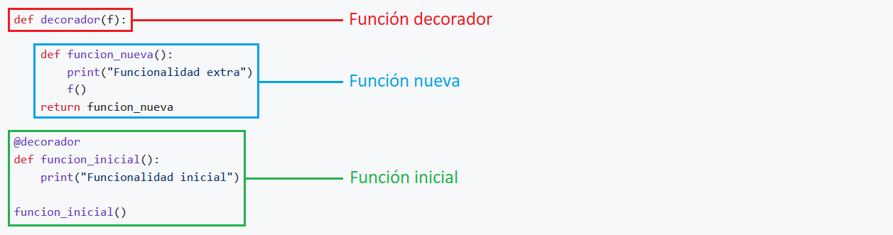

---
hide:
  #- navigation
  #- toc
---

# 3. ¿Qué es un decorador?

<p>Los decoradores son funciones que toman otra función como argumento y anidan una nueva función para agregarle código extra sin alterar la existente.</p>

<p>En el siguiente ejemplo, puedes ver la <strong>estructura general de una función decoradora</strong>.</p>

!!! tip "TIP"
    Si alguna vez has visto <code>@</code>, estás ante un <strong>decorador</strong>.
<br>


<br>

<p><strong>Código Python 👇</strong></p>

```python
def decorador(f):

    def funcion_nueva():
        print('Funcionalidad extra')
        f()
    return funcion_nueva

@decorador
def funcion_inicial():
    print('Funcionalidad inicial')

funcion_inicial()
```
<br>

### 🕵️ Analicemos estos elementos en más detalle:

- Esta es la <code>función_inicial</code> que el <code>@decorador</code> va tomar como referencia.
```python
@decorador
def funcion_inicial():
    print('Funcionalidad inicial')

funcion_inicial()
```

- Esta es una función intermediaria que va hacer la <strong>decoradoración</strong> <code>def decorador</code>. El nombre de la función hace referencia a <code>@decorador</code>. Toma <code>(f)</code> como argumento para invocar <code>f()</code> más adelante dentro de la <code>función_nueva()</code> que va ir anidada.

```python
def decorador(f):
    def funcion_nueva():
        print('Funcionalidad extra')
        f()
    return funcion_nueva
```

- Si ejecutamos el código, podemos ver el siguiente resultado:

```
Funcionalidad extra
Funcionalidad inicial
```
<br>
<br>
