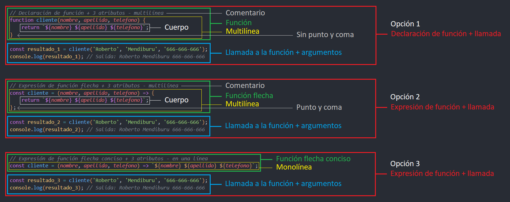

---
hide:
  #- navigation
  #- toc
---

Las **funciones flecha** permiten escribir funciones de manera más concisa y legible, especialmente cuando se trata de **funciones cortas o funciones de una sola línea**.

### :material-arrow-right-box: Sintaxis de una función flecha:
  - La sintaxis básica de una función flecha es la siguiente: ==() => {}==
    - {==()==} Se utiliza para pasarle atributos a una función
    - {===>==} Se define como función flecha, es una función anónima sin nombre
    - {=={}==} Se utiliza para envolver el cuerpo de la función
<br>
<br>

  - Las funciónes flecha, pueden ser de varios tipos:
    - Multilínea
    - Monolínea


==Una función flecha es simplemente una expresión de función compacta== frente a una **expresión de función tradicional**. A diferencia de una **declaración de función**, las de **expresión de función** ==siempre deben acabar en punto y coma==.
***
<br>

## **3.1. Tipos de funciónes:**
Antes de nada, veamos una **comparativa entre diferentes tipos de funciones**, esto es de vital importancia para entender como funciona cada uno, en que se relacionan y en que situaciones es conveniente utilizar uno u otro.

### Ejemplo 1
En este ejemplo, vamos a comparar **4 tipos de función equivalentes** y ver **en que se diferencian**. Para ello, hemos utilizado una ==declaración de función==, una ==expresión de función==, una ==expresión de función flecha== y una ==expresión de función flecha conciso==. Ninguno incluye atributos.

### :material-code-braces-box: ==Declaración de función== (multilínea) + llamada:
  - Si **no contiene atributos**, ==los paréntesis== estarán vacíos, pero ==deben estar presentes==.
  - Al ser una **función multilínea**, ==las llaves deben estar presentes==.
  - Al ser una **declaración de función**, ==no lleva punto y coma al final==.

```js linenums="1"
function cliente() {
    console.log('¡Bienvenido!');
}

cliente(); // Salida: ¡Bienvenido!
```

### :material-code-braces-box: ==Expresión de función== (multilínea) + llamada:
  - Si **no contiene atributos**, ==los paréntesis== estarán vacíos, pero ==deben estar presentes==.
  - Al ser una **función multilínea**, ==las llaves deben estar presentes==.
  - Al ser una **expresión de función**, ==lleva punto y coma al final==.

```js linenums="1"
const cliente = function() {
    console.log('¡Bienvenido!');
};

cliente(); // Salida: ¡Bienvenido!
```

### :material-code-braces-box: ==Expresión de función flecha== (multilínea) + llamada:
  - Si **no contiene atributos**, ==los paréntesis== estarán vacíos, pero ==deben estar presentes==.
  - Al ser una **función multilínea**, ==las llaves deben estar presentes==.
  - Al ser una **expresión de función**, ==lleva punto y coma al final==.

```js linenums="1"
const cliente = () => {
    console.log('¡Bienvenido!');
};

cliente(); // Salida: ¡Bienvenido!
```

### :material-code-braces-box: ==Expresión de función flecha conciso== (monolínea) + llamada:
  - Si **no contiene atributos**, ==los paréntesis== estarán vacíos, pero ==deben estar presentes==.
  - Al ser una **función monolínea**, ==las llaves pueden omitirse==.
  - Al ser una **expresión de función**, ==lleva punto y coma al final==.

```js linenums="1"
const cliente = () => console.log('¡Bienvenido!');

cliente(); // Salida: ¡Bienvenido!
```

<br>

### Ejemplo 2
Veamos el segundo ejemplo, esta vez, le pasamos **1 atributo** en la función:

### :material-code-braces-box: ==función flecha== (multilínea) + ==1 atributo==:
  - Las **funciones flecha** ==con un solo atributo, los paréntesis pueden omitirse==.
  - Al ser una **función multilínea**, ==las llaves deben estar presentes==.
  - Al ser una **expresión de función**, ==lleva punto y coma al final==.

```js linenums="1"
const cliente = (nombre) => { // antes
    console.log(`${nombre}`);
};

const cliente = nombre => { // despues
    console.log(`${nombre}`);
};
```

### :material-code-braces-box: ==función flecha conciso== (monolínea) + ==1 atributo==:
  - Las **funciones flecha** ==con un solo atributo, los paréntesis pueden omitirse==.
  - Al ser una **función monolínea**, ==las llaves pueden omitirse==.
  - Al ser una **expresión de función**, ==lleva punto y coma al final==.

```js linenums="1"
const cliente = (nombre) => { console.log(`${nombre}`) }; // antes

const cliente = nombre => console.log(`${nombre}`); // despues
```

<br>

### Ejemplo 3
Veamos el tercer ejemplo, esta vez, le pasamos **1 argumento** en la llamada:

### :material-code-braces-box: ==función flecha== (multilínea) + ==1 argumento en la llamada==:

```js linenums="1"
const cliente = nombre => {
    console.log(`${nombre}`);
};

cliente('Roberto'); // Salida: Roberto
```

### :material-code-braces-box: ==función flecha conciso== (monolínea) + ==1 argumento en la llamada==:

```js linenums="1"
const cliente = nombre => console.log(`${nombre}`);

cliente('Roberto'); // Salida: Roberto
```

<br>

### Ejemplo 4
Veamos el cuarto ejemplo, a diferencia del segundo ejemplo, aqui le pasamos **2 atributos** en la función y **2 argumentos** en la llamada a la función.

### :material-code-braces-box: ==función flecha== + ==2 atributos== + ==2 argumentos==:
  - Las **funciones flecha** ==con mas de un atributo, los paréntesis deben estar presentes==.
  - Al ser una **función multilínea**, ==las llaves deben estar presentes==.
  - Al ser una **expresión de función**, ==lleva punto y coma al final==.

```js linenums="1"
const cliente = (nombre, apellido) => {
    console.log(`${nombre} ${apellido}`);
};

cliente('Roberto', 'Mendiburu'); // Salida: Roberto Mendiburu
```

### :material-code-braces-box: ==función flecha conciso== + ==2 atributos== + ==2 argumentos==:
  - Las **funciones flecha** ==con mas de un atributo, los paréntesis deben estar presentes==.
  - Al ser una **función monolínea**, ==las llaves pueden omitirse==.
  - Al ser una **expresión de función**, ==lleva punto y coma al final==.

```js linenums="1"
const cliente = (nombre, apellido) => console.log(`${nombre} ${apellido}`);

cliente('Roberto', 'Mendiburu'); // Salida: Roberto Mendiburu
```
***
<br>

## **3.2. Tipos de funciónes flecha:**
Las **funciones flecha** (arrow functions) son indudablemente una de las características más populares de **ES6** (EcmaScript 6). Ellas introducen una nueva forma de escribir ==funciones concisas==. Es importante notar que las **funciones flecha** ==son anónimas==, lo que significa que ==no tienen nombre== y ==no se pueden utilizar como metodos ni constructores dentro de una clase==.

### :material-arrow-right-box: Características:
  - Siempre son expresiones.
  - Siempre deberemos asignar la expresión a una variable.
  - Pueden ser de varios tipos:
    - ==Expresión de función flecha== (multilínea)
    - ==Expresión de función flecha conciso== (monolínea)
<br>

### :material-arrow-right-box: Expresión de función flecha (multilínea):
Esta función, esta construido en bloque. Al no estar toda la función en una misma línea, se trataria de una ==**expresión de función flecha** (multilínea) y no obtendria las características de un (monolínea)==.

  - Al ser una **expresión de función**, ==debe asignarse a una **variable**==.
  - La **expresión de función flecha** ==elimina la palabra clave **function**==.
  - Una **función flecha** ==con mas de un atributo, los **paréntesis** deben estar presentes==.
  - Al ser una **función multilínea**, ==las **llaves** deben estar presentes==.
  - Al ser una **función multilínea**, ==el **return** debe estar presente==.
  - Al ser una **expresión de función**, ==lleva **punto y coma** al final==.

### :material-code-braces-box: ==Función flecha== + ==2 atributos== + ==2 argumentos==:
```js linenums="1"
const sumar = (a, b) => {
    return a + b;
};

const resultado = sumar(2, 6);
console.log(resultado); // Salida: 8
```

### :material-code-braces-box: ==función flecha== + ==3 atributos== + ==3 argumentos==:
```js linenums="1"
const cliente = (nombre, apellido, telefono) => {
    return `${nombre} ${apellido} ${telefono}`;
};

const resultado = cliente('Roberto', 'Mendiburu', '666-666-666');
console.log(resultado); // Salida: Roberto Mendiburu 666-666-666
```
<br>

### :material-arrow-right-box: Expresión de función flecha conciso (monolínea):
En este ejemplo, podemos observar cómo la **expresión de función flecha conciso** ==elimina la necesidad de escribir== la palabra clave ==function==, las llaves =={}== y la declaración ==return==, resultando en una **expresión más compacta**.

  - Al ser una **expresión de función**, ==debe asignarse a una **variable**==.
  - La **expresión de función flecha** ==elimina la palabra clave **function**==.
  - Una **función flecha** ==con mas de un atributo, los **paréntesis** deben estar presentes==.
  - Al ser una **función monolínea**, ==las **llaves** pueden omitirse==.
  - Al ser una **función monolínea**, ==el **return** puede omitirse==.
  - Al ser una **expresión de función**, ==lleva **punto y coma** al final==.

### :material-code-braces-box: ==Función flecha conciso== + ==2 atributos== + ==2 argumentos==:
```js linenums="1"
const sumar = (a, b) => a + b;

const resultado = sumar(2, 6);
console.log(resultado); // Salida: 8
```

### :material-code-braces-box: ==función flecha conciso== + ==3 atributos== + ==3 argumentos==:
```js linenums="1"
const cliente = (nombre, apellido, telefono) => `${nombre} ${apellido} ${telefono}`;

const resultado = cliente('Roberto', 'Mendiburu', '666-666-666');
console.log(resultado); // Salida: Roberto Mendiburu 666-666-666
```
***
<br>

## **3.3. Análisis de funciones:**
Veamos una comparativa entre 3 tipos de funciones 👇

  - Opción 1: ==Función tradicional==
  - Opción 2: ==Función flecha==
  - Opción 3: ==Función flecha conciso==

```js title="ejemplo.js" linenums="1"
// Opción 1:
// Declaración de función + 3 atributos - multilínea
function cliente(nombre, apellido, telefono) {
    return `${nombre} ${apellido} ${telefono}`;
}

const resultado_1 = cliente('Roberto', 'Mendiburu', '666-666-666');
console.log(resultado_1); // Salida: Roberto Mendiburu 666-666-666


// Opción 2:
// Expresión de función flecha + 3 atributos - multilínea
const cliente = (nombre, apellido, telefono) => {
    return `${nombre} ${apellido} ${telefono}`;
};

const resultado_2 = cliente('Roberto', 'Mendiburu', '666-666-666');
console.log(resultado_2); // Salida: Roberto Mendiburu 666-666-666


// Opción 3:
// Expresión de función flecha conciso + 3 atributos - monolínea
const cliente = (nombre, apellido, telefono) => `${nombre} ${apellido} ${telefono}`;

const resultado_3 = cliente('Roberto', 'Mendiburu', '666-666-666');
console.log(resultado_3); // Salida: Roberto Mendiburu 666-666-666
```

### 🕵️ Analicemos las diferencias:


Las **funciones flecha** pueden componerse de ==más de una línea==, lo cual ya ==nos obligará a emplear las **llaves** y el **return**==.

<br>
<br>
