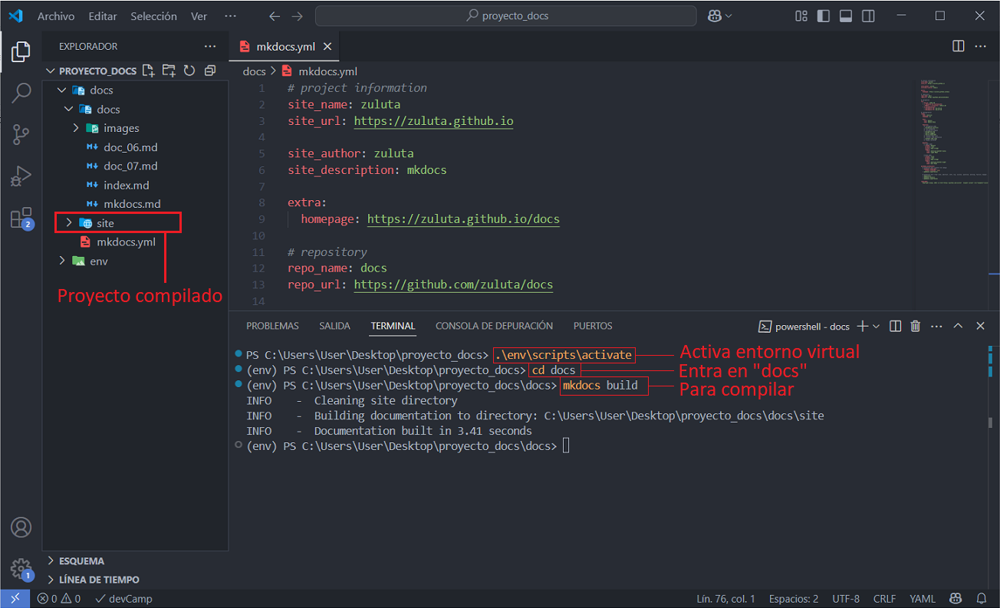

---
hide:
  #- navigation
  - toc
---

# Despliegue de proyecto local a GitHub Pages

<strong>01.</strong> Accede a GitHub y crea un repositorio nuevo.

 
 

<strong>02.</strong> Escribe el mismo nombre del proyecto local, deja en público y pulsa el botón crear repositorio.

 
 

<strong>03.</strong> Muestra los comandos y la URL remota del repositorio creado.

 
 

<strong>04.</strong> Comandos para sincrinizar por primera vez GIT con GitHub desde la terminal de VSCode.

  - (==git init==) Inicia el GIT
  - (==git config --global user.name "nombre_usuario"==) Usuario de GitHub
  - (==git config --global user.email "micorreo@ejemplo.com"==) Email de GitHub
 

<strong>05.</strong> Comandos de terminal mas utilizados en GIT.

  - (==git init==) Inicia el GIT
  - (==git add .==) Agrega todos los archivos al GIT
  - (==git add ejemplo.html==) Agrega los archivos indibidualmente al GIT
  - (==git commit -m "inserta el mensaje aqui"==) Agrega un commit al GIT
  - (==git branch -M main==) Fuerza a renombrar la rama local actual por (main) {~~actual~> main~~}
  - (==git remote add origin https://github.com/usuario/mi_repositorio.git==) Agrega la url remota del repositorio GitHub
  - (==git remote -v==) Verifica la comunicación con el repositorio remoto
  - (==git status==) Muestra el estado de los procesos GIT
  - (==git push -u origin main==) Sube los archivos a la rama main del repositorio GitHub

!!! info "El orden de ejecución"

    El orden de ejecución, variara en función de lo que quieras hacer. Por lógica, primero se inicia el GIT, se agregan los archivos, se envia un commit, la verificación de estado y la comunicación con el repositorio solo nos da información, no hace ningun cambio en el repositorio.
 

<strong>06.</strong> Entra en VSCode y abre una terminal nueva.

  - Desde la carpeta de trabajo "proyecto_docs", activa el entorno virtual (==.\env\scripts\activate==)
  - Accede a la carpeta del proyecto "docs" y lanza el comando (==mkdocs build==) para compilar, ésto creara una nueva carpeta llamada {++site++} donde compilara todo el proyecto.

 
 

<strong>07.</strong> Desde la carpeta del proyecto "docs", abre la terminal y prepara el repositorio GIT para subir al repositorio GitHub.

  - Ejecuta el comando (==git init==)
  - Ejecuta el comando (==git add .==)
  - Ejecuta el comando (==git commit -m "despliegue"==)
  - Ejecuta el comando (==git branch -M main==)
  - Ejecuta el comando (==git remote add origin https://github.com/zuluta/docs.git==)
  - Ejecuta el comando (==git remote -v==)
  - Ejecuta el comando (==git status==)
  - Ejecuta el comando (==git push -u origin main==)

!!! info "NOTA"
    La rama "master" y "main" son lo mismo. Hace unos años, la comunidad de software decidió cambiar el nombre de la rama principal de {--master--} a {++main++}. Verifica con el comando ({==git branch==}) las ramas existentes en tu repositorio local y si existe la rama master, pasa a la rama master con el comando ({==git switch master==}) y cambia el nombre de la rama con el comando ({==git branch -m main==}) o ({==git branch -M main==}) para forzarlo. De este modo, solo se dejara una rama principal con el nombre "main" por repositorio.

 
 

<strong>08.</strong> Entra al repositorio y verifica si se subieron bien los archivos a GitHub en la rama main.

 
 

<strong>09.</strong> GitHub permite crear una pagina web gratis desde el repositorio.

  - Ejecuta el comando (==mkdocs gh-deploy==)
  

Este comando es específico de mkdocs para GitHub. Este comando creara de forma automática una nueva rama {++gh_pages++} en el mismo repositorio del proyecto para poder desplegar GitHub Pages.

<strong>10.</strong> Entra al repositorio de GitHub y verifica si se creo la rama "gh-pages".

 
 

<strong>11.</strong> Entra en Settings, luego en Pages, donde pone Branch, selecciona la rama "gh-pages" y la carpeta "(root)". Pulsa el botón de guardar y espera unos segundos a que se active la página.

 
 

<strong>12.</strong> Entra en Settings, luego en Pages, donde pone GitHub Pages, verifica que la página este operativa.

 
 

<strong>13.</strong> Si necesitas actualizar GitHub Pages por nuevos cambios, ejecuta lo siguiente.

  - Desde la carpeta de trabajo "proyecto_docs", activa el entorno virtual ({==.\env\scripts\activate==})
  - Accede a la carpeta del proyecto "docs" y lanza el comando (==mkdocs build==)
  - Ejecuta el comando (==git init==)
  - Ejecuta el comando (==git add .==)
  - Ejecuta el comando (==git commit -m "actualizar contenido"==)
  - Ejecuta el comando (==git branch==)
  - Ejecuta el comando (==git switch main==)
  - Ejecuta el comando (==git remote add origin https://github.com/zuluta/docs.git==)
  - Ejecuta el comando (==git remote -v==)
  - Ejecuta el comando (==git status==)
  - Ejecuta el comando (==git push -u origin main==) Se sube a la rama "main" del repositorio donde se guarda el proyecto
  - Ejecuta el comando (==mkdocs gh-deploy==) Compila y despliega a la rama "gh-pages" del repositorio. Ésta rama, va enlazado al sitio web de GitHub Pages
  - Verifica los cambios en la página
 
 
