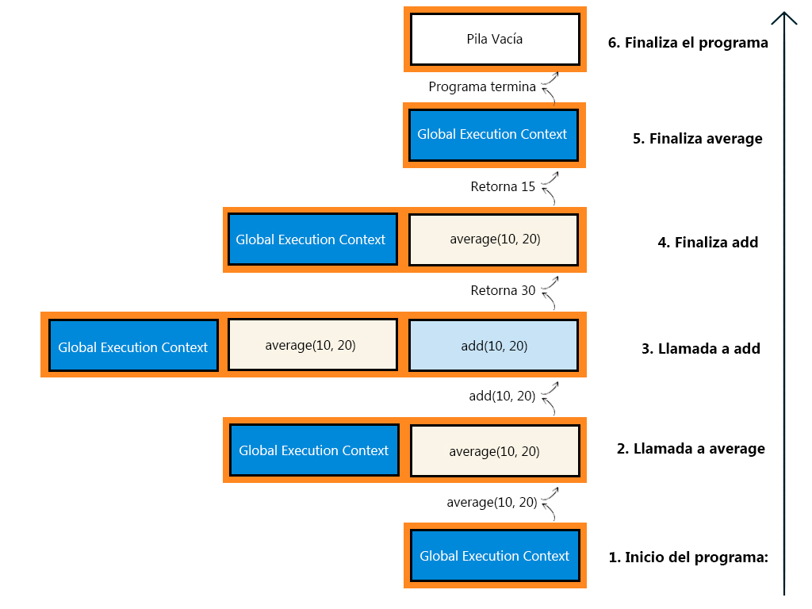

---
hide:
  #- navigation
  - toc
---

<link rel="stylesheet" href="../../assets/stylesheets/javascript.css">

# **Call Stack: Entendiendo la Pila de Llamadas**

La pila de llamadas o call stack es un mecanismo en el cual se utiliza el motor de JavaScript para gestionar la ejecución de funciones. Entender cómo funciona te ayudará a escribir código más eficiente y depurar problemas con mayor facilidad.

En este artículo exploraremos cómo funciona la pila de llamadas, cómo gestiona los contextos de ejecución y qué sucede cuando ocurre un desbordamiento de pila.

## **¿Qué es la Pila de Llamadas en JavaScript?**

La pila de llamadas es una estructura de datos que sigue el principio de **LIFO** (Last In, First Out, el último en entrar es el primero en salir). Se utiliza para rastrear qué función se está ejecutando actualmente y qué funciones han sido llamadas desde esa función.

### **Cómo funciona la pila de llamadas**

  1. Cuando se ejecuta un script, el motor de JavaScript crea un [contexto de ejecución global](../contexto-de-ejecucion/) y lo coloca en la pila.
  2. Cada vez que se llama a una función, se crea un **contexto de ejecución de función** y se coloca en la parte superior de la pila.
  3. Cuando una función termina, su contexto de ejecución se elimina de la pila, y el control vuelve al contexto anterior.
  4. El script se detiene cuando la pila está vacía.

## **Ejemplo básico: Pila de Llamadas en acción**

Para entender cómo funciona el Call Stack, analicemos un ejemplo simple:

```js linenums="1" title="javascript"
function add(a, b) {
    return a + b;
}

function average(a, b) {
    return add(a, b) / 2;
}

let result = average(10, 20);

console.log(result);
```

### **Paso a paso en la pila de llamadas**

  1. **Inicio del programa**: Se crea el contexto de ejecución global y se coloca en la pila.
  2. **Llamada a `average(10, 20)`**: Se crea un nuevo contexto de ejecución para `average` y se coloca en la parte superior de la pila.
  3. **Dentro de `average`, llamada a la función `add(10, 20)`**: Se crea un contexto de ejecución para `add` y se coloca en la pila.
  4. **`add` termina su ejecución**: Se elimina su contexto de la pila, y el control regresa a `average`.
  5. **`average` termina su ejecución**: Se elimina su contexto de la pila, y el control regresa al contexto global.
  6. **El programa finaliza**: Se muestra el resultado en consola, y la pila queda vacía.

Aquí está la representación de cómo la pila de llamadas evoluciona durante la ejecución del código anterior:

<br>



<br>

La pila crece de abajo hacia arriba (LIFO – Last In First Out) El Global Execution Context siempre permanece en la base de la pila Las nuevas llamadas se apilan encima de las existentes.

## **Desbordamiento de Pila (Stack Overflow)**

La pila de llamadas tiene un tamaño limitado, definido por el entorno de ejecución (navegador o Node.js). Si se crean demasiados contextos de ejecución sin completarlos, ocurre un stack overflow, y el programa se detiene.

```js linenums="1" title="javascript"
function recursive() {
    recursive();
}

recursive();

// RangeError: Maximum call stack size exceeded
```

En el ejemplo anterior la función `recursive` se llama a sí misma indefinidamente. La pila sigue creciendo con cada llamada sin eliminar contextos de ejecución, eventualmente, el tamaño máximo de la pila se alcanza, y se lanza un error.

## **JavaScript es un lenguaje de un solo hilo**

JavaScript es un lenguaje de programación de un solo hilo, lo que significa que solo puede ejecutar una tarea a la vez dentro de su proceso principal. Esto se debe a que utiliza un único hilo de ejecución para procesar operaciones, siguiendo un modelo basado en eventos. Esta característica, aunque puede parecer una limitación, está diseñada para mantener el lenguaje ligero y eficiente, especialmente para aplicaciones web.

Considera el siguiente ejemplo, que muestra cómo JavaScript maneja las tareas de manera secuencial:

```js linenums="1" title="javascript"
console.log("Inicio del programa");

function tareaPesada() {
    for (let i = 0; i < 1e9; i++) {} // Simula una operación pesada
    console.log("Tarea pesada completada");
}

tareaPesada();

console.log("Fin del programa");
```

En este caso, ninguna otra tarea puede ejecutarse mientras `tareaPesada` está en progreso, porque JavaScript solo tiene un hilo principal para manejar todo.

### **Implicaciones del modelo de un solo hilo**

El modelo de un solo hilo tiene ventajas y desafíos:

### **Ventajas:**

  1. **Facilidad para manejar estados**: Dado que solo se ejecuta una tarea a la vez, no tienes que preocuparte por condiciones de carrera ni problemas de concurrencia que ocurren en lenguajes multihilo.
  2. **Eficiencia en aplicaciones web**: JavaScript está diseñado para interactuar con el DOM de manera rápida y efectiva, y el modelo de un solo hilo evita conflictos en la manipulación de elementos.

### **Desafíos:**

  1. **Bloqueos del hilo principal**: Si una tarea toma mucho tiempo (como tareaPesada en el ejemplo), el navegador no puede procesar eventos, lo que provoca una mala experiencia de usuario.
  2. **Gestión de operaciones concurrentes**: Aunque JavaScript maneja bien las tareas asincrónicas, requiere una comprensión del event loop y las colas de tareas.

><br>
> Para evitar bloquear el hilo principal, puedes delegar tareas intensivas a operaciones asincrónicas utilizando funciones como setTimeout, promesas o async/await. Este enfoque permite mantener el hilo principal libre para procesar otras tareas, mejorando la respuesta de la aplicación.
>
><br>

***

### **Conclusión**

El Call Stack o Pila de llamada es fundamental para entender cómo JavaScript ejecuta el código y gestiona los contextos de ejecución. Conocer cómo funciona y cómo manejar errores como el desbordamiento de pila es esencial para escribir código eficiente y depurar problemas complejos.

En el próximo artículo exploraremos el [event loop](../event-loop/), que es clave para entender cómo JavaScript maneja tareas asincrónicas.

***

<br>
