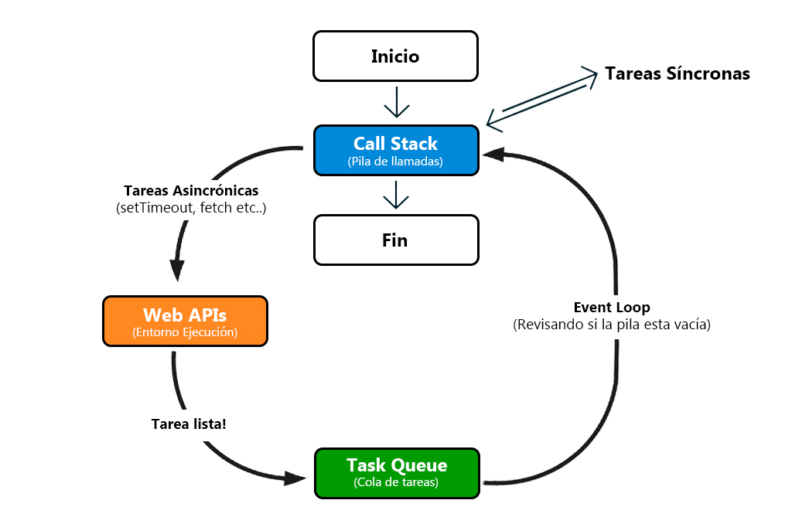

---
hide:
  #- navigation
  - toc
---

<link rel="stylesheet" href="../../assets/stylesheets/javascript.css">

# **Event Loop**

El event loop (bucle de eventos) es un componente fundamental del tiempo de ejecución de JavaScript que permite manejar tareas asincrónicas y coordinar su ejecución con las operaciones síncronas. Aunque JavaScript es un lenguaje de un solo hilo, gracias al event loop puede gestionar tareas concurrentes sin bloquear la ejecución principal.

En este artículo exploraremos cómo funciona el event loop, qué papel desempeñan las colas de tareas y las APIs del navegador y cómo puedes usar esta comprensión para optimizar el rendimiento de tus aplicaciones.

## **¿Qué es el Event Loop?**

El event loop es un proceso que constantemente verifica dos componentes principales del entorno de ejecución de JavaScript:

  1. **[La pila de llamadas](../call-stack/) (call stack)**: Donde se procesan las funciones y contextos de ejecución.
  2. **La cola de tareas (task queue)**: Donde se almacenan las tareas asincrónicas pendientes, como callbacks de temporizadores o eventos del DOM.

Cuando la pila de llamadas está vacía, el event loop transfiere las tareas pendientes desde la cola de tareas a la pila de llamadas, asegurando que se ejecuten una a una en orden.

## **Cómo funciona el Event Loop**

El funcionamiento del event loop puede parecer complejo al principio, pero sigue un flujo claro y definido. Este mecanismo coordina la ejecución de las tareas síncronas y asincrónicas para garantizar que el código se procese de manera ordenada.

  1. **Ejecución inicial**: El script principal se ejecuta desde el principio hasta el final, manejando funciones y operaciones síncronas.
  2. **Tareas asincrónicas**: Las tareas como `setTimeout`, promesas y eventos del DOM se delegan a las APIs del navegador (o Node.js en entornos de servidor).
  3. **Cola de tareas**: Cuando una tarea asincrónica está lista para ejecutarse (por ejemplo, después de que un temporizador expire), se coloca en la cola de tareas.
  4. **Interacción del event loop**: El event loop verifica constantemente la pila de llamadas. Si está vacía, toma la primera tarea de la cola de tareas y la coloca en la pila para ejecutarla.



Event Loop: Constantemente revisa si puede mover tareas de la Cola a la Pila

### **Ejemplo básico del Event Loop**

Para entender un poco en la práctica, veamos un ejemplo sencillo que combina operaciones síncronas y una tarea asincrónica con `setTimeout`. Este ejemplo ilustrará cómo JavaScript maneja la ejecución de las tareas y cuándo las coloca en la cola de tareas para procesarlas.

```js linenums="1" title="javascript"
console.log("Inicio del programa");

setTimeout(() => {
    console.log("Tarea desde setTimeout");
}, 1000);

console.log("Fin del programa");
```

**Explicación del ejemplo anterior:**

  1. **Inicio del programa**: La función `console.log("Inicio del programa")` se ejecuta inmediatamente.
  2. **Tarea asincrónica**: La función `setTimeout` delega su tarea a las APIs del navegador, configurando un temporizador de 1 segundo.
  3. **Fin del programa**: La última instrucción síncrona, `console.log("Fin del programa")`, se ejecuta inmediatamente.
  4. **Tarea en la cola**: Después de 1 segundo, la callback de `setTimeout` se mueve de la cola de tareas a la pila de llamadas y se ejecuta.

## **Web APIs y su interacción con el Event Loop**

El event loop no opera solo; trabaja en conjunto con las **Web APIs**, que gestionan tareas asincrónicas como:

  - **Temporizadores**: (`setTimeout`, `setInterval`).
  - **Peticiones HTTP**: (`fetch`, `XMLHttpRequest`).
  - **Eventos del DOM**: (clics, movimientos del mouse, etc.).

Por ejemplo, cuando llamas a `setTimeout`, el temporizador se gestiona fuera del motor de JavaScript por las APIs del navegador, y su callback se coloca en la cola de tareas una vez que expira el tiempo.

## **Colas de microtareas y macrotareas**

En JavaScript, el event loop no solo maneja la ejecución de las tareas de manera secuencial, sino que también organiza las tareas en diferentes colas dependiendo de su prioridad. Estas colas principales son:

  - **Microtareas**: Tienen la máxima prioridad y se procesan antes de las macrotareas. (Promesas resueltas (`Promise.then()` o `async/await`). `MutationObserver`)
  - **Macrotareas**: Son tareas de menor prioridad y se ejecutan después de todas las microtareas pendientes (Temporizadores como `setTimeout` y `setInterval`, eventos del DOM o Operaciones de I/O en Node.js)

Este mecanismo asegura que las tareas críticas (como la resolución de promesas) se procesen lo antes posible, mientras que otras tareas menos urgentes (como `setTimeout`) esperan su turno.


### **Ejemplo: Prioridad de microtareas**

```js linenums="1" title="javascript"
console.log("Inicio");

setTimeout(() => {
    console.log("Macrotarea: setTimeout");
}, 0);

Promise.resolve().then(() => {
    console.log("Microtarea: Promesa resuelta");
});

console.log("Fin");
```

><br>
> La recomendación es evitar el abuso de microtareas. si se abusa en sus encadenamientos, estas pueden bloquear temporalmente la ejecución de macrotareas importantes. Por otra parte se recomienda optimizar las macrotareas. Dividir tareas grandes en fragmentos más pequeños para no bloquear la interfaz de usuario.
>
><br>

## **Errores comunes relacionados con el Event Loop**

  1. **Bloqueo del hilo principal**: Tareas intensivas como grandes bucles o cálculos pueden bloquear la pila de llamadas y retrasar la ejecución de tareas asincrónicas.
  2. **Dependencia de la prioridad de tareas**: No comprender cómo las microtareas y macrotareas se procesan puede causar comportamientos inesperados en tu aplicación.

***

### **Conclusión**

El event loop es una pieza fundamental del runtime de JavaScript que permite la gestión eficiente de tareas concurrentes. Comprender su funcionamiento, junto con las colas de microtareas y macrotareas, es clave para escribir aplicaciones más rápidas y reactivas.

***

<br>
