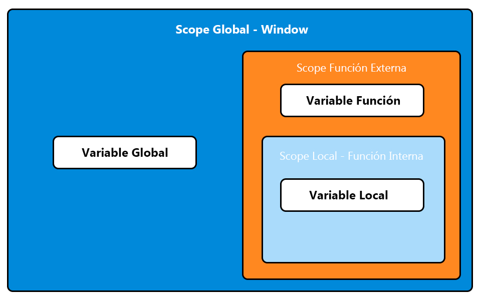

---
hide:
  #- navigation
  - toc
---

<link rel="stylesheet" href="../../assets/stylesheets/javascript.css">

# **Variable Scope: Alcances de las Variables**

El alcance (scope) de una [variable en JavaScript](../variables/) define dónde es visible y accesible dentro del código. Comprender los diferentes tipos de alcance es importante para escribir código más limpio, predecible y eficiente.

En este artículo exploraremos los tres tipos principales de scope en JavaScript: **global**, **local** y **de bloque**, así como conceptos adicionales como la cadena de alcance (_scope chain_) y las fugas de variables globales.

## **¿Qué es el Scope en JavaScript?**

El alcance determina la visibilidad y accesibilidad de una variable en el programa. Cuando una variable se declara, su alcance define las partes del código que pueden acceder a ella. JavaScript proporciona los siguientes tipos principales de scope:

  1. **Scope global**: Las variables declaradas fuera de cualquier función o bloque pertenecen al scope global.
  2. **Scope local (de función)**: Las variables declaradas dentro de una función solo son accesibles dentro de esa función.
  3. **Scope de bloque**: Introducido con ES6, aplica a variables declaradas con `let` y `const` dentro de bloques `{}`.



## **Alcance Goblal**

Las variables definidas en el scope global o alcance global son accesibles desde cualquier parte del programa. Se crean al declarar una variable fuera de funciones o bloques.

```js linenums="1" title="javascript"
var mensaje = "Hola desde el global";

function saludar() {
    console.log(mensaje); // Accede a la variable global
}

saludar();
console.log(mensaje); // También accesible aquí
```

En el código anterior, `mensaje` es una variable global. Puede ser utilizada tanto dentro como fuera de la función `saludar`.

Aunque las variables globales pueden parecer convenientes, abusar de ellas puede causar problemas de mantenimiento y depuración en programas grandes.

## **Alcance Local**

Las variables declaradas dentro de una función son locales a esa función. No son accesibles fuera de su contexto.

```js linenums="1" title="javascript"
function decirHola() {
    var saludo = "Hola desde el local";
    console.log(saludo); // "Hola desde el local"
}

decirHola();
console.log(saludo); // ReferenceError: saludo no está definido
```

En el código anterior `saludo` es una variable local declarada dentro de la función `decirHola`. No se puede acceder a `saludo` desde fuera de la función.

Cuando se ejecuta una función, el motor de JavaScript crea un contexto de ejecución para esa función, aislando sus variables del resto del programa.

## **Alcance de Bloque**

Con la introducción de `let` y `const` en ES6, es posible declarar variables limitadas a un bloque `{}`. Esto incluye estructuras como `if`, `for` o cualquier otro bloque de código.

```js linenums="1" title="javascript"
if (true) {
    let mensaje = "Hola desde el bloque";
    console.log(mensaje); // "Hola desde el bloque"
}

console.log(mensaje); // ReferenceError: mensaje no está definido
```

La variable `mensaje` solo es accesible dentro del bloque `if`. Al intentar acceder a `mensaje` fuera del bloque, se genera un error.

El scope de bloque ayuda a reducir errores relacionados con variables que se comparten entre bloques, mejorando la claridad del código.

## **La Cadena de Scope (Scope Chain)**

Cuando JavaScript busca una variable, primero verifica el contexto actual. Si no la encuentra, sube al siguiente nivel del alcance actual (función contenedora o global). Este proceso se llama **scope chain**.

```js linenums="1" title="javascript"
var mensaje = "Hola desde el global";

function mostrarMensaje() {
    console.log(mensaje); // Busca en el scope local, luego global
}

mostrarMensaje(); // "Hola desde el global"
```

En el ejemplo anterior, Si `mensaje` no estuviera declarado globalmente, JavaScript arrojaría un error. La cadena de scope asegura que el motor busque la variable en contextos externos.

## **Fugas de Variables Globales**

Una variable global puede crearse accidentalmente si no se declara con `var`, `let` o `const`. Esto ocurre porque JavaScript asigna automáticamente la variable al objeto global.

```js linenums="1" title="javascript"
function contador() {
    numero = 10; // No se declara explícitamente
    return numero;
}

console.log(contador()); // 10
console.log(numero); // 10 (se crea en el scope global)
```

**Solución**: Usa `"use strict"` para evitar fugas de variables globales. Esto asegura que las variables no declaradas arrojen un error.

```js linenums="1" title="javascript"
"use strict";

function contador() {
    numero = 10; // ReferenceError: numero no está definido
    return numero;
}

contador();
```

## **Buenas Prácticas para el Uso del Scope**

  1. **Prefiere `let` y `const` sobre `var`**: Ayudan a evitar problemas de alcance y hacen el código más predecible.
  2. **Mantén las variables lo más locales posible**: Esto reduce el riesgo de conflictos y facilita el mantenimiento.
  3. **Evita fugas de variables globales**: Siempre declara tus variables explícitamente.
  4. **Usa `const` para valores inmutables**: Define variables que no cambian con `const` para proteger su estado.

***

### **Conclusión**

El scope es uno de los pilares fundamentales para escribir código JavaScript eficiente y fácil de depurar. Conocer los tipos de alcance, desde el global hasta el de bloque, te permitirá tomar decisiones más informadas al declarar variables y estructurar tu código.

***

<br>
