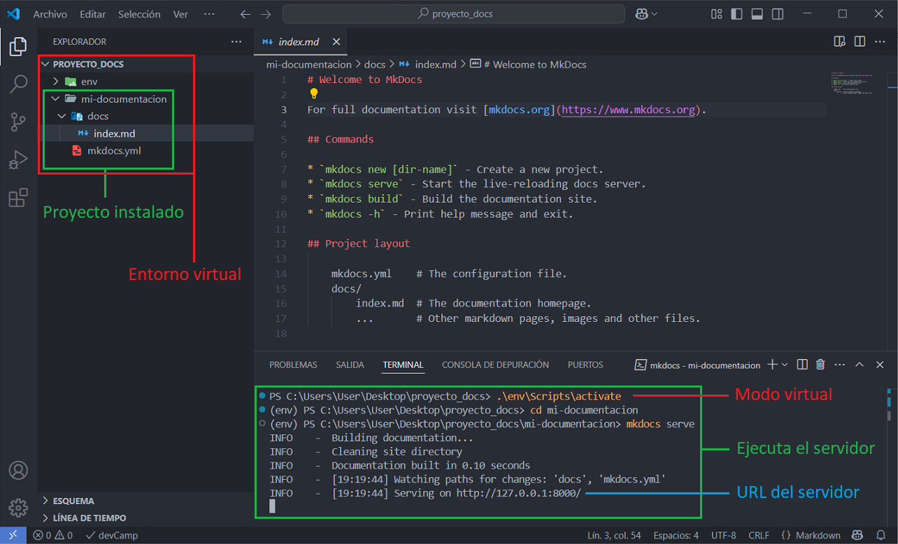

---
hide:
  #- navigation
  - toc
---

# Instalar MkDocs con Python y virtualenv

<strong>01.</strong> Verifica si Python y virtualenv están instalados de forma global y si no aparecen, instalalos.

 

<strong>02.</strong> Entra en “escritorio” y crea una carpeta de trabajo que se llame ({++proyecto-docs++}) con el comando ({==mkdir proyecto-docs==}).

<strong>03.</strong> Entra en “proyecto-docs” y crea una carpeta virtual que se llame ({++env++}).

<strong>04.</strong> Actíva la carpeta “env” en modo virtual con el comando ({==.\env\scripts\activate==}).

<strong>05.</strong> Instala la librería dentro de la carpeta “env” con el comando ({==pip install mkdocs==}).

 

<strong>06.</strong> Verifica si la librería mkdocs se instaló bien.

 

<strong>07.</strong> Crea nuevo proyecto de mkdocs que se llame ({++mi-documentacion++}).

<strong>08.</strong> Verifica si el proyecto se creó bien y desactiva el entorno virtual con el comando ({==deactivate==}). Cierra la terminal.

 

<strong>09.</strong> Abre VSCode y carga la carpeta del escritorio “proyecto-docs” desde el menu superior (<strong>Archivo / Abrir carpeta…</strong>).

 

<strong>10.</strong> Dentro del proyecto “mi-documentacion”, abre el archivo que pone index.md.

<strong>11.</strong> Abre una nueva terminal desde el menu superior (<strong>... / Terminal / Nuevo terminal</strong>) para ejecutar el servidor en local. Recordar que la librería mkdocs se instaló en un entorno virtual por lo que sera necesario primero activar el entorno virtual desde la carpeta de trabajo “proyecto-docs” con el
comando ({==.\env\Scripts\activate==}). Luego entra en la carpeta del proyecto “mi-documentación” y desde ahí, ejecutar
el siguiente comando ({==mkdocs serve==}), esto ejecutara el servidor local.

 

<strong>12.</strong> Para verificar, copia la URL del servidor y abre en el navegador, le aparecerá la página de bienvenida por defecto.

 

<strong>13.</strong> Con esto, ya tendrias instalado la librería mkdocs en un entorno virtual y creado el proyecto para empezar a editar tu propia documentación, porfolio, o lo que quieras de forma local.

<strong>14.</strong> Ahora que ya tenemos mkdocs en marcha, toca instalar un tema desarrollado para mkdocs que le va dar un
diseño mucho mas moderno. Abre la terminal de VSCode, pulsa (ctrl + c) para detener el servidor, activa el entorno virtual, accede a la carpeta “mi-documentación” y desde ahí ejecuta el comando ({==pip install mkdocs-material==}).
Una vez terminada la instalación, abre el archivo “mkdocs.yml” y modifica el nombre del tema. En este caso, se llama {++material++}. El tema que viene instalado por defecto se llama “readthedocs”.

 

<strong>15.</strong> Para finalizar, recarga la página y veras un aspecto mucho mas moderno de tu sitio web.

 
 
