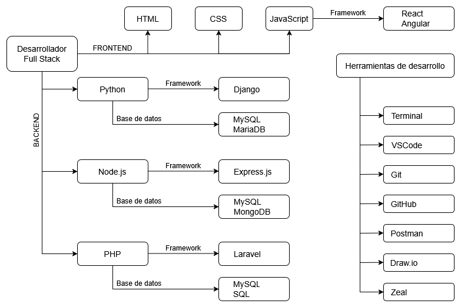

---
hide:
  #- navigation
  - toc
---

# Desarrollador Full Stack

El programador Full Stack es el profesional encargado de desarrollar páginas web, tanto en el FRONTEND como en el BACKEND. Para desempeñar sus funciones, que incluyen desde el diseño de interfaces hasta el desarrollo de arquitecturas y la optimización del sitio web, debe combinar una serie de conocimientos técnicos y creativos.

## Diagrama

 

Creado con [app.diagrams.net](https://app.diagrams.net/)
 
